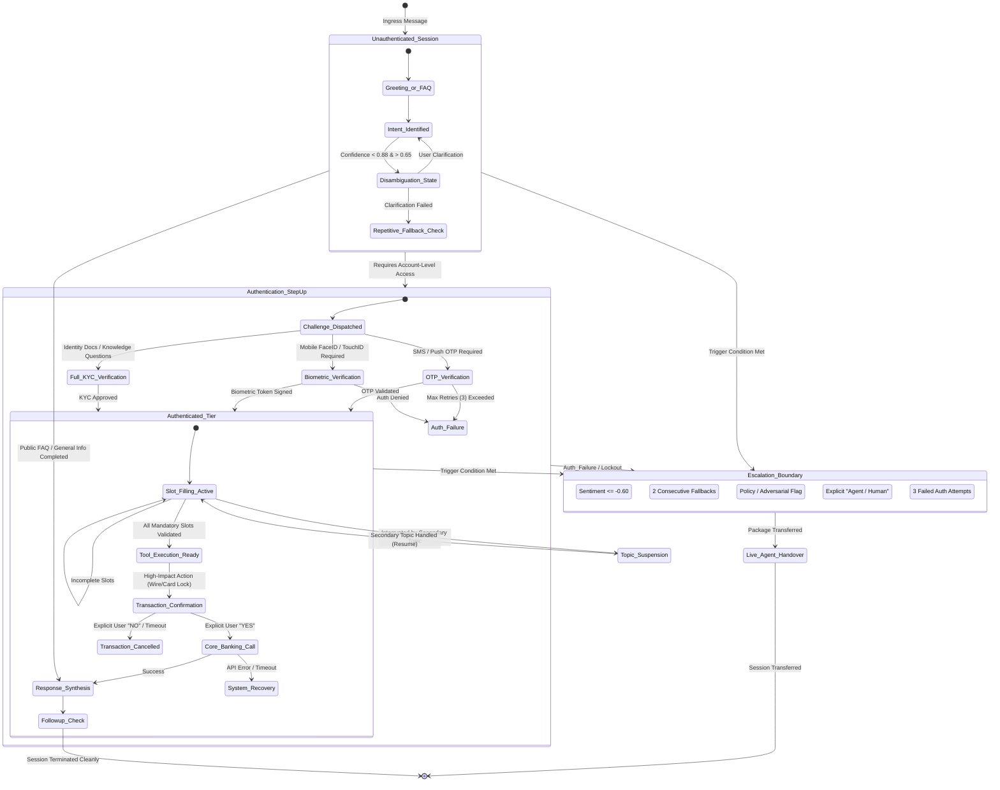

# NexBank Agentic AI Customer Service: Dialogue State Machine & Context Reasoning

## 1. Executive Overview

The Dialogue State Machine (DSM) is the authoritative, deterministic brain of the NexBank conversational system. While Large Language Models provide linguistic flexibility and natural language generation, financial regulations and transaction safety require that conversation progression, authentication step-ups, entity resolution, and escalation decisions remain governed by a strictly validated state machine.

This document specifies the Dialogue State Schema, authentication privilege tiers, multi-turn reasoning mechanisms, context window management, and formal state transition rules.

---

## 2. Dialogue State Transition Diagram



---

## 3. Comprehensive Dialogue State Schema

The session state is serialized as a strongly-typed Pydantic model and backed by Redis with a sliding TTL of 1,800 seconds (30 minutes). Every turn re-validates against this schema.

```json
{
  "$schema": "https://json-schema.org/draft/2020-12/schema",
  "title": "NexBankDialogueState",
  "type": "object",
  "required": [
    "session_id",
    "conversation_id",
    "customer_id",
    "current_turn_index",
    "auth_level",
    "active_intent",
    "intent_confidence",
    "slot_state",
    "sentiment_trajectory",
    "guardrail_flags",
    "escalation_proximity",
    "turn_history"
  ],
  "properties": {
    "session_id": {
      "type": "string",
      "format": "uuid",
      "description": "Unique ephemeral session identifier"
    },
    "conversation_id": {
      "type": "string",
      "format": "uuid",
      "description": "Cross-channel thread ID"
    },
    "customer_id": {
      "type": ["string", "null"],
      "description": "Unique banking customer ID (null if anonymous)"
    },
    "channel": {
      "type": "string",
      "enum": ["MOBILE_APP", "WEB_PORTAL", "TELEPHONY_IVR", "SECURE_MESSAGING"]
    },
    "current_turn_index": {
      "type": "integer",
      "minimum": 0,
      "description": "Monotonically increasing turn counter"
    },
    "auth_level": {
      "type": "string",
      "enum": [
        "ANONYMOUS",
        "DEVICE_RECOGNIZED",
        "OTP_VERIFIED",
        "BIOMETRIC_VERIFIED",
        "FULL_KYC_VERIFIED"
      ],
      "description": "Current verified authentication privilege tier"
    },
    "active_intent": {
      "type": "string",
      "description": "Canonical intent key (e.g., 'transfers.wire_domestic')"
    },
    "intent_confidence": {
      "type": "number",
      "minimum": 0.0,
      "maximum": 1.0,
      "description": "Confidence score of the active intent from NLU pipeline"
    },
    "slot_state": {
      "type": "object",
      "description": "Map of target slots, values, validation flags, and confirmation status",
      "additionalProperties": {
        "type": "object",
        "properties": {
          "raw_value": { "type": ["string", "number", "boolean", "null"] },
          "normalized_value": { "type": ["string", "number", "boolean", "null"] },
          "status": {
            "type": "string",
            "enum": ["EMPTY", "EXTRACTED", "VALIDATED", "INVALID", "CONFIRMED"]
          },
          "extraction_confidence": { "type": "number", "minimum": 0.0, "maximum": 1.0 },
          "source_turn": { "type": "integer" }
        },
        "required": ["status", "extraction_confidence", "source_turn"]
      }
    },
    "suspended_flows": {
      "type": "array",
      "description": "Stack of interrupted topic contexts waiting to be resumed",
      "items": {
        "type": "object",
        "properties": {
          "intent": { "type": "string" },
          "slots": { "type": "object" },
          "suspended_at_turn": { "type": "integer" }
        },
        "required": ["intent", "slots", "suspended_at_turn"]
      }
    },
    "sentiment_trajectory": {
      "type": "object",
      "description": "Real-time rolling sentiment score tracking customer emotional state",
      "properties": {
        "current_score": {
          "type": "number",
          "minimum": -1.0,
          "maximum": 1.0,
          "description": "-1.0 = Highly Agitated/Angry, 0.0 = Neutral, +1.0 = Highly Satisfied"
        },
        "rolling_average_last_3": { "type": "number", "minimum": -1.0, "maximum": 1.0 },
        "sentiment_slope": {
          "type": "string",
          "enum": ["STABLE", "IMPROVING", "DETERIORATING", "CRITICAL_DROP"]
        },
        "detected_emotions": {
          "type": "array",
          "items": { "type": "string", "enum": ["FRUSTRATION", "URGENCY", "CONFUSION", "SATISFACTION", "HOSTILITY"] }
        }
      },
      "required": ["current_score", "rolling_average_last_3", "sentiment_slope"]
    },
    "guardrail_flags": {
      "type": "object",
      "description": "Accumulated safety and compliance audit flags",
      "properties": {
        "pii_detected_count": { "type": "integer", "minimum": 0 },
        "injection_attempt_detected": { "type": "boolean" },
        "unauthorized_financial_advice_prevented": { "type": "boolean" },
        "hallucination_suppression_count": { "type": "integer", "minimum": 0 },
        "advisory_disclaimer_attached": { "type": "boolean" }
      },
      "required": [
        "pii_detected_count",
        "injection_attempt_detected",
        "unauthorized_financial_advice_prevented",
        "hallucination_suppression_count"
      ]
    },
    "escalation_proximity": {
      "type": "object",
      "description": "Quantitative escalation index measuring closeness to human handover",
      "properties": {
        "proximity_score": {
          "type": "number",
          "minimum": 0.0,
          "maximum": 1.0,
          "description": "1.0 indicates immediate mandatory escalation"
        },
        "consecutive_fallback_count": { "type": "integer", "minimum": 0 },
        "failed_auth_attempts": { "type": "integer", "minimum": 0 },
        "primary_trigger": { "type": ["string", "null"] }
      },
      "required": ["proximity_score", "consecutive_fallback_count", "failed_auth_attempts"]
    },
    "turn_history": {
      "type": "array",
      "description": "Trimmed chronological conversation history for context assembly",
      "items": {
        "type": "object",
        "properties": {
          "turn_index": { "type": "integer" },
          "timestamp": { "type": "string", "format": "date-time" },
          "speaker": { "type": "string", "enum": ["USER", "AGENT", "SYSTEM"] },
          "masked_utterance": { "type": "string" },
          "intent": { "type": "string" },
          "action_taken": { "type": "string" }
        },
        "required": ["turn_index", "timestamp", "speaker", "masked_utterance"]
      }
    }
  }
}
```

---

## 4. Authentication Levels & Privilege Matrix

Banking operations require strictly graduated authorization. The DSM checks whether the user's active `auth_level` fulfills the intent's required privilege:

| Privilege Level | Permitted Operations | Verification Mechanism | Invalidation Conditions |
| :--- | :--- | :--- | :--- |
| **`ANONYMOUS`** | Public FAQs, branch locations, routing numbers, product info, general interest rates | None (Session IP / Cookie only) | Never expires, upgraded upon login |
| **`DEVICE_RECOGNIZED`** | App shell, masked account nicknames, cached notification counts | Hardware device token + TLS client cert | Device unpairing, app reinstallation |
| **`OTP_VERIFIED`** | Balance inquiry, transaction history, statement downloads, debit card temporary lock | SMS OTP (6 digits) or Push Notification approval | 15 minutes inactivity, IP change |
| **`BIOMETRIC_VERIFIED`** | Domestic wire transfers (<$5,000), bill pay, card PIN reissue, overdraft settings | Native FIDO2 / WebAuthn / FaceID signed assertion | Turn timeout (5 min), app backgrounding |
| **`FULL_KYC_VERIFIED`** | High-value wire (>$5,000), change of residential address, add authorized user | Dual-factor: Biometric + Out-of-band Banker / Video verification | Single transaction scope only |

---

## 5. Multi-Turn Reasoning Strategies

### 5.1. Anaphora & Coreference Resolution
* **The Problem**: Customer says: *"What was the fee on my last transfer?"* followed by *"Can you refund it?"*
* **Resolution Strategy**:
  1. The DSM maintains an **Entity Reference Stack** ordered by recency.
  2. Pronouns (*"it"*, *"that"*, *"the second one"*, *"the former"*) trigger coreference substitution against the latest matching typed entity in the stack.
  3. When *"refund it"* is processed, the entity stack indicates `last_referenced_entity = {type: "TRANSACTION_FEE", transaction_id: "TX_99341", amount: 15.00}`.
  4. The query rewriter normalizes the intent to: `fee_dispute.request_refund(transaction_id="TX_99341", amount=15.00)`.

### 5.2. Topic Switching & Flow Suspension
* **The Problem**: While halfway through filling slots for a domestic wire transfer, customer asks: *"Wait, what is my checking account balance right now?"*
* **Resolution Strategy**:
  1. When NLU identifies an intent incompatible with the active slot-filling flow, the DSM does **not** discard the existing form.
  2. The current active state (e.g., `transfers.wire_domestic` with filled `recipient_name` and `routing_number`) is pushed to `suspended_flows` stack.
  3. The DSM switches to `accounts.check_balance`, fulfills the query, and presents the answer.
  4. Prompt injection hook executes: *"Your current balance is $4,210.50. Would you like to continue with your transfer of $500 to John Doe?"*
  5. If user confirms, the DSM pops `transfers.wire_domestic` back into `active_intent` and resumes slot-filling from the next missing slot (`account_number`).

### 5.3. Contradiction Handling & Slot Overwrite Safeguards
* **The Problem**: Customer specifies: *"Send 500 dollars to Alice"*, then two turns later states: *"Actually, make that 750 dollars to Bob"*.
* **Resolution Strategy**:
  1. Slots have explicit `extraction_confidence` and `status` values.
  2. When an entity of the same slot type is provided, the DSM evaluates whether it is an intentional modification or a contradiction.
  3. Conversational markers (*"actually"*, *"change that"*, *"no, I meant"*, *"instead"*) trigger the **Slot Revision Protocol**:
     - The previous slot value is archived in a `slot_revision_history` array.
     - The new slot value is written with status `EXTRACTED`.
     - The agent explicitly reflects the update: *"Got it, I updated the transfer amount to $750 and the recipient to Bob. Before I proceed, please confirm if this is correct."*
  4. High-value slots (Amounts, Recipient IBAN/Account Number) require explicit confirmation prior to transition to `Core_Banking_Call`.

### 5.4. Context Window Management & Token Pruning
* **Constraints**: To guarantee sub-2.0s LLM inference and avoid context drift, the prompt context window is bounded to 4,000 tokens maximum.
* **Pruning Policy**:
  1. **System Prompt & Guardrail Instructions**: Static, pinned (800 tokens).
  2. **Active Dialogue State Summary**: Compact structured JSON summary generated dynamically (300 tokens).
  3. **Retrieved RAG Chunks**: Top-3 reranked chunks only (800 tokens).
  4. **Dynamic Conversation Buffer**:
     - Retains the last 4 turns verbatim.
     - Turns 5 through 20 are compressed into a 150-word rolling semantic summary updated asynchronously on every second turn.
     - Turns older than 20 are purged from LLM prompt context but preserved in the audit database.

---

## 6. Escalation Proximity Calculation

The `escalation_proximity` score $P \in [0.0, 1.0]$ is computed dynamically on every turn:

$$P = \min\left(1.0, \; 0.35 \cdot C_{\text{fallback}} + 0.30 \cdot S_{\text{negative}} + 0.25 \cdot A_{\text{auth\_fail}} + 0.40 \cdot G_{\text{guardrail}}\right)$$

Where:
* $C_{\text{fallback}}$: Consecutive fallback count ($\ge 2 \implies 1.0$).
* $S_{\text{negative}}$: Normalized negative sentiment score ($\text{if } \text{score} < -0.40 \implies \frac{|\text{score}| - 0.40}{0.60}$, else $0$).
* $A_{\text{auth\_fail}}$: Failed authentication attempts count ($2 \text{ fails} \implies 0.5, \; 3 \text{ fails} \implies 1.0$).
* $G_{\text{guardrail}}$: Boolean flag for high-severity policy or adversarial injection detection ($1.0$ if triggered).

**Rule**: If $P \ge 0.75$, the orchestrator immediately triggers `Escalation_Boundary` and prepares the live banker transfer package.
