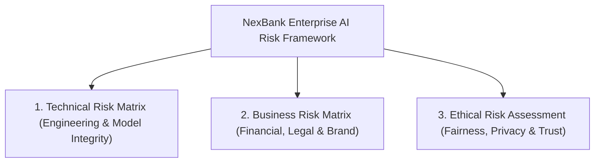
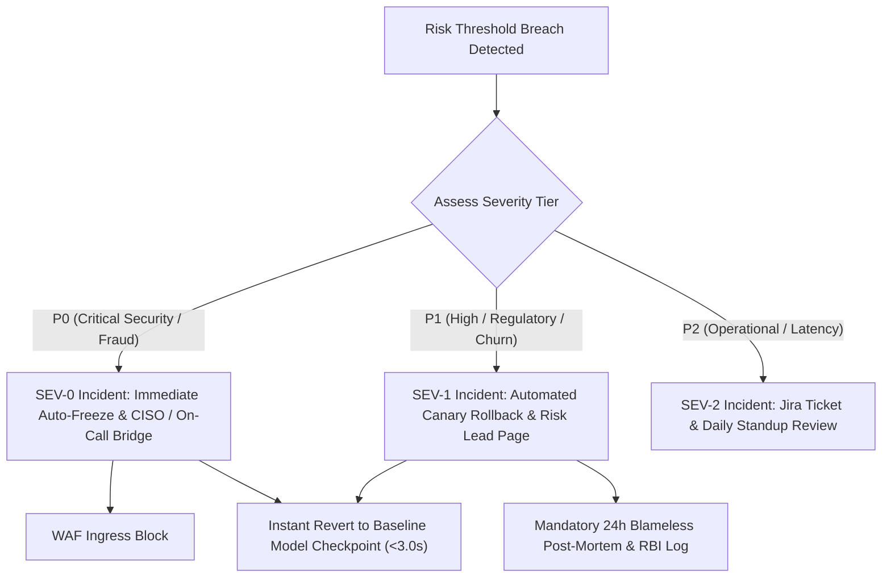

# NexBank Conversational AI Comprehensive Risk Assessment & Mitigation Matrix

```
Document Reference: DOC-RISK-001
Classification: Confidential - Enterprise Model Risk Governance
Version: 1.0.0 (Phase 7 / Day 15 Release)
Effective Date: 2026-10-02
Governing Body: NexBank Model Risk Oversight Committee (MROC) & Board Risk Committee
Framework Alignment: NIST AI Risk Management Framework (AI RMF 1.0) & RBI IT Governance Framework
```

---

## 1. Executive Summary & Enterprise Risk Framework

Deploying an autonomous agentic AI system within a regulated commercial bank entails operational, financial, legal, and ethical exposures. To ensure resilience and regulatory defensibility, NexBank operates an integrated three-tier risk management framework:



### Risk Scoring & Severity Scale

$$\text{Risk Score} = \text{Probability (1 to 5)} \times \text{Impact (1 to 5)}$$

* **P0 (Critical Severity, Score 16–25)**: Immediate threat to customer financial assets, regulatory license, or systemic solvency. Hard automated mitigation required.
* **P1 (High Severity, Score 10–15)**: Significant financial loss, severe customer dissatisfaction, or formal ombudsman complaint. Dedicated circuit breakers required.
* **P2 (Medium Severity, Score 1–9)**: Minor operational friction, degraded user experience, or temporary non-critical service delay. Monitored through daily SLA tracking.

---

## 2. Technical Risk Matrix (Engineering, AI & Model Integrity)

The Technical Risk Matrix evaluates vulnerabilities arising from model behavior, distributed systems architecture, latency spikes, and retrieval pipelines.

| Risk ID | Technical Failure Mode | Description & Root Cause | Prob (1-5) | Impact (1-5) | Risk Score | Severity | Engineered Mitigation & Circuit Breaker Architecture |
| :--- | :--- | :--- | :--- | :--- | :--- | :--- | :--- |
| **`TR-001`** | **LLM Hallucination / Fact Fabrication** | Model invents non-existent interest rates, waivers, or branch policies during long context generation. | 3 | 5 | 15 | **P1** | **Strict RAG Groundedness Check**: Layer 4 prompt enforcement + automated NLI entailment checker (DeBERTa-v3) requiring claim entailment $\ge 0.95$ against approved KB chunks. Non-entailed claims trigger fallback. |
| **`TR-002`** | **Model Drift & Latent Shift** | Continuous learning updates cause latent feature representation drift, degrading safety bounds over time. | 3 | 4 | 12 | **P1** | **Two-Sample KS Drift Test**: Daily Kolmogorov-Smirnov distribution testing ($p < 0.05$ threshold) on latent embeddings; automated sub-3.0s circuit breaker rollback to stable baseline on drift detection. |
| **`TR-003`** | **Context Window Overflow** | Multi-turn customer sessions exceed token capacity (8,192 tokens), truncating Layer 0/1 safety prompts. | 2 | 5 | 10 | **P1** | **Sliding Memory Summarizer**: FIFO turn truncation with permanent pinning of Layers 0–2 immutable headers; turns $> 15$ trigger mandatory escalation (`ESC-010`). |
| **`TR-004`** | **Knowledge Base Staleness** | Outdated interest rate sheets or circulars remain indexed in vector databases after policy changes. | 3 | 4 | 12 | **P1** | **Dual-Author Maker-Checker TTL**: Strict `ttl_seconds` and mandatory `expiry_date` metadata on all KB chunks; expired entries are purged automatically by cron cleaners. |
| **`TR-005`** | **Downstream CBS API Cascading Failure** | Core Banking System (Finacle) or UPI switch experiences timeouts, locking worker threads and causing OOM crashes. | 3 | 4 | 12 | **P1** | **Resilience4j / Envoy Circuit Breakers**: Max 500ms API timeout; after 5 consecutive failures, circuit opens and serves cached read-only balances or triggers `ESC-014` gracefully. |
| **`TR-006`** | **Latency Spikes (p99 > 3,500ms)** | Concurrency surges or complex RAG cross-encoding cause response delays, violating SLA budgets. | 3 | 3 | 9 | **P2** | **Token Streaming & Semantic Caching**: Redis semantic cache for frequent queries (sub-50ms) + vLLM continuous batching; dynamic pod autoscaling (HPA) at 70% CPU/GPU saturation. |
| **`TR-007`** | **Adversarial Jailbreak / Prompt Injection** | Attackers use nested roleplays, hypotheticals, or encoded ciphers to override system safety rules. | 2 | 5 | 10 | **P1** | **Multi-Layer Defensive Firewall**: Layer 1 regex filters + Layer 2 safety classifier + ephemeral Canary UUID token leak interceptors with instant IP auto-ban. |
| **`TR-008`** | **Cross-Tenant Data Leakage** | Caching or state persistence bugs expose one user's account details to a concurrent session. | 1 | 5 | 5 | **P0** | **Session Isolation & Zero-Shared-Memory**: State machines run in sandboxed tenant contexts with Redis cryptographic key salting (`cust_id:session_id:hash`). |

---

## 3. Business Risk Matrix (Financial, Legal, Reputational & Regulatory)

The Business Risk Matrix analyzes the enterprise impact of system failures on customer trust, statutory compliance, and balance sheet performance.

| Risk ID | Business Risk Category | Exposure Scenario | Prob (1-5) | Impact (1-5) | Risk Score | Severity | Statutory Defense & Operational Mitigation |
| :--- | :--- | :--- | :--- | :--- | :--- | :--- | :--- |
| **`BR-001`** | **Regulatory Sanctions & Fines (RBI / SEBI)** | Unauthorized financial advice rendered to retail investors violating SEBI (Investment Advisers) Regulations, 2013, or violation of RBI Digital Payment Controls. | 1 | 5 | 5 | **P0** | **Immutable Safety Layer 1 & 2**: Hash-locked system prompts prohibiting stock/fund advice; zero-tolerance automated CI/CD golden test suite (100% pass rate gate); warm handoff to certified human RIAs (`ESC-013`). |
| **`BR-002`** | **High-Value Customer Churn** | Wealth / Premier customers experiencing frustrating robotic loops, incorrect guidance, or delays during account closure inquiries. | 3 | 4 | 12 | **P1** | **VIP Priority Concierge Dispatch (`ESC-007`)**: Instant detection of high net worth balances ($> 5\text{L}$); automated bypass of deflection logic directly to dedicated human Relationship Managers within 5 minutes. |
| **`BR-003`** | **Direct Financial Liability / Fraud Claims** | Failure to freeze stolen debit cards or report phishing takeovers immediately, leading to customer loss under RBI Customer Protection Master Direction. | 2 | 5 | 10 | **P0** | **Emergency Card Freeze Automation (`ESC-001`)**: Immediate execution of `emergency_card_freeze()` upon fraud trigger detection before conversation continuation; 24x7 SOC escalation within 120 seconds. |
| **`BR-004`** | **Brand & Reputational Degradation** | Hallucinated or offensive AI utterances screenshotted and publicized on social media platforms (X / LinkedIn). | 2 | 4 | 8 | **P2** | **Output Moderation Layer**: Llama-Guard / NeMo toxicity filters scanning all outgoing tokens for brand safety, profanity, and reputational risk; canned refusal fallbacks. |
| **`BR-005`** | **Contact Center Banker Attrition** | Human bankers overwhelmed by garbage escalations or having to re-interview customers from scratch. | 2 | 3 | 6 | **P2** | **Zero-Repetition Context Package**: Pre-populates 8-element dossier directly into CRM screens with one-click core banking action forms, reducing banker handle time by 45%. |

---

## 4. Ethical Risk Assessment & Responsible AI Governance

In adherence to the NIST AI RMF, UNESCO Ethics of AI Recommendations, and Indian Digital Personal Data Protection (DPDP) Act, NexBank evaluates four ethical dimensions:

### 1. Fairness & Demographic Bias
* **Identified Risk**: Language or sentiment models exhibiting lower classification accuracy for regional dialects, non-standard English phrasing, or low-income applicant demographics.
* **Mitigation**:
  * Extensive multilingual training on curated Indic language corpora (Hindi, Hinglish, Marathi, Tamil, Bengali).
  * Disparate impact ratio monitoring ($> 0.80$ rule) across demographic cohorts during loan eligibility inquiries (`LOA-002`).
  * Exclusion of protected demographic variables (caste, religion, gender, marital status) from all model prompt contexts and underwriting feature vectors.

### 2. Transparency & AI Identity Disclosure
* **Identified Risk**: Customers mistakenly believing they are conversing with a human banker, leading to misplaced trust or confusion regarding regulatory representations.
* **Mitigation**:
  * **Mandatory Layer 0 Non-Deception Policy**: The agent explicitly introduces itself as *"Nexie, NexBank's AI Assistant"* on the opening turn.
  * Direct questions regarding identity (*"Are you a human?"*) are answered with complete transparency: *"I am an AI customer service agent developed by NexBank."*
  * All conversational logs and statements clearly mark AI authorship in audit trails.

### 3. Accountability & Human-in-the-Loop Governance
* **Identified Risk**: AI operating as an unaccountable "black box" where neither customer nor bank staff can ascertain why a transaction was refused or delayed.
* **Mitigation**:
  * Every decision has a deterministic trace linking to a specific rule, vector chunk (`[Source: KB-XXXX]`), or confidence score.
  * Right to Human Escalation: Any customer demanding a human agent 3 times (`ESC-006`) is transferred immediately without automated friction.
  * Adverse decisions (loan rejection, account freeze) provide statutory grievance redressal channels and contact information for the RBI Banking Ombudsman.

### 4. Data Privacy & Confidentiality (DPDP Act Compliance)
* **Identified Risk**: PII, account numbers, or authentication secrets leaking into model context buffers, third-party LLM providers, or persistent storage.
* **Mitigation**:
  * **Zero Third-Party Cloud Transmission**: All inference occurs within NexBank's VPC and dedicated on-premise GPU clusters; zero user data is transmitted to public API endpoints.
  * **Presidio + Regex Scrubbing**: Masking of PAN, Aadhaar, CVV, and mobile numbers prior to vector storage or logging.
  * **Cryptographic Shredding**: Full compliance with 30-day DPDP right-to-erasure through HSM key deletion.

---

## 5. Risk Incident Response & Escalation Framework

When an operational or model risk crosses a critical threshold, the following incident management workflow is automatically invoked:


