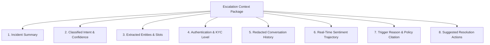

# NexBank Escalation Context Package & Zero-Repetition Protocol

```
Document Reference: DOC-ESC-003
Classification: Confidential - NexBank Internal Architecture
Version: 1.0.0 (Phase 6 / Day 12 Release)
Effective Date: 2026-10-02
Review Cycle: Monthly Banker Experience & Security Alignment
Target Architecture: CRM Integration (Salesforce / Genesys Cloud / Microsoft Dynamics)
```

---

## 1. Zero-Repetition Handover Philosophy

A primary driver of customer friction during contact center escalations is being forced to restate their identity, account number, problem statement, and steps already attempted. The NexBank platform guarantees an absolute **Zero-Repetition Handover**:

> **The Zero-Repetition Guarantee**:
> Prior to the human banker saying *"Hello"*, the CRM desktop terminal receives a fully synthesized, pre-validated 8-element context package containing the root issue, extracted entity slots, verified identity tier, transcript, and one-click execution actions.

---

## 2. The 8-Element Context Package Schema

Every escalated session generates a canonical JSON context package complying with the strict 8-element schema detailed below:



### Complete JSON Schema Specification

```json
{
  "$schema": "https://json-schema.nexbank.internal/v1/escalation-context-package.json",
  "escalation_id": "ESC-20261002-99412",
  "session_id": "f51a7042-9f33-4f51-b841-399120ba0123",
  "timestamp": "2026-10-02T12:04:15.821Z",
  "customer_tier": "PREMIER",
  
  "element_1_incident_summary": {
    "executive_summary": "Customer Jane Doe (Premier Tier) is attempting an outbound domestic wire of INR 75,000 to recipient 'Acme Technologies Pvt Ltd' for vendor invoice clearance. Biometric authentication completed successfully on device. Escalated because transaction amount exceeds automated self-service conversational limit of INR 50,000.",
    "business_urgency": "HIGH",
    "estimated_handle_time_seconds": 180
  },

  "element_2_classified_intent_and_confidence": {
    "primary_intent_code": "TXN-004",
    "primary_intent_name": "transfer.domestic.wire",
    "primary_intent_confidence": 0.964,
    "secondary_intent_candidate": "ACC-001 (balance_check)",
    "secondary_intent_confidence": 0.021,
    "intent_stability_score": 0.99
  },

  "element_3_extracted_entities": {
    "source_account": {
      "account_number_masked": "XXXX-XXXX-4912",
      "account_type": "PREMIER_CURRENT",
      "available_balance_inr": 284500.00
    },
    "transfer_amount": {
      "value": 75000.00,
      "currency": "INR"
    },
    "beneficiary_name": "Acme Technologies Pvt Ltd",
    "beneficiary_account_masked": "XXXX-XXXX-8821",
    "ifsc_code": "HDFC0000060",
    "bank_name": "HDFC Bank Ltd",
    "payment_purpose": "Vendor Invoice Settlement",
    "all_required_slots_filled": true
  },

  "element_4_authentication_level": {
    "auth_status": "BIOMETRIC_VERIFIED",
    "auth_factors_completed": [
      "DEVICE_FINGERPRINT_MATCH",
      "APP_MPIN_CONFIRMED",
      "FIDO2_WEBAUTHN_BIOMETRIC"
    ],
    "auth_token_ref": "AUTH_TOKEN_77a98b21c4",
    "step_up_required_for_banker": false,
    "device_trust_score": 0.992
  },

  "element_5_full_conversation_history_redacted": {
    "total_turns": 4,
    "turns": [
      {
        "turn_id": 1,
        "speaker": "USER",
        "timestamp": "2026-10-02T12:02:10Z",
        "text": "Hi, I need to make an urgent wire transfer of 75000 rupees to Acme Technologies right away.",
        "pii_redacted": false
      },
      {
        "turn_id": 2,
        "speaker": "AGENT",
        "timestamp": "2026-10-02T12:02:13Z",
        "text": "I can assist you with an instant wire transfer to Acme Technologies Pvt Ltd for INR 75,000. Please authorize with your fingerprint.",
        "pii_redacted": false
      },
      {
        "turn_id": 3,
        "speaker": "USER",
        "timestamp": "2026-10-02T12:03:01Z",
        "text": "[Biometric Authentication Completed]",
        "pii_redacted": false
      },
      {
        "turn_id": 4,
        "speaker": "AGENT",
        "timestamp": "2026-10-02T12:03:05Z",
        "text": "Authentication verified. Because this transfer exceeds the conversational self-service limit of INR 50,000, I am transferring you directly to our Wire Settlement Specialists. All your transaction details have been pre-filled.",
        "pii_redacted": false
      }
    ]
  },

  "element_6_real_time_sentiment_trajectory": {
    "final_sentiment_score": 0.15,
    "trajectory_slope": "SLIGHT_UPWARD",
    "sentiment_per_turn": [
      {"turn": 1, "score": -0.10, "state": "URGENT"},
      {"turn": 2, "score": 0.05, "state": "REASSURED"},
      {"turn": 3, "score": 0.10, "state": "SATISFIED"},
      {"turn": 4, "score": 0.15, "state": "CALM"}
    ],
    "frustration_keywords_detected": ["urgent"]
  },

  "element_7_trigger_reason_and_citation": {
    "trigger_id": "ESC-005",
    "trigger_name": "High-Value Transaction / Dispute Ceiling Exceeded",
    "priority_level": "P1",
    "sla_target_seconds": 300,
    "policy_rule_reference": "NEXBANK-POL-OPS-04.2 (Conversational AI Transaction Limits)",
    "statutory_citation": "RBI Master Direction on Digital Payment Security Controls Section 7.2"
  },

  "element_8_suggested_resolution_actions": [
    {
      "action_id": "ACT-01",
      "action_type": "ONE_CLICK_CORE_BANKING_EXECUTE",
      "action_label": "Execute Pre-Filled Wire Transfer (INR 75,000)",
      "target_system": "FINACLE_CBS_API",
      "pre_filled_payload": {
        "debit_account": "XXXX-XXXX-4912",
        "credit_account": "XXXX-XXXX-8821",
        "amount": 75000.00,
        "currency": "INR",
        "ifsc": "HDFC0000060",
        "auth_ref": "AUTH_TOKEN_77a98b21c4"
      },
      "requires_banker_dual_auth": false
    },
    {
      "action_id": "ACT-02",
      "action_type": "RECOMMENDED_OPENING_STATEMENT",
      "action_label": "Suggested Greeting",
      "template": "Hello Jane, I see you are transferring INR 75,000 to Acme Technologies. I have your verified biometric authorization and the transfer form completely prepared. May I have your verbal confirmation to execute?"
    }
  ]
}
```

---

## 3. Pydantic Technical Model Specification

```python
from pydantic import BaseModel, Field
from typing import List, Dict, Any, Optional

class IncidentSummary(BaseModel):
    executive_summary: str
    business_urgency: str = Field(..., pattern="^(CRITICAL|HIGH|MEDIUM|LOW)$")
    estimated_handle_time_seconds: int

class IntentTelemetry(BaseModel):
    primary_intent_code: str
    primary_intent_name: str
    primary_intent_confidence: float = Field(..., ge=0.0, le=1.0)
    secondary_intent_candidate: Optional[str] = None
    secondary_intent_confidence: Optional[float] = None
    intent_stability_score: float

class ExtractedEntities(BaseModel):
    source_account: Dict[str, Any]
    transfer_amount: Optional[Dict[str, Any]] = None
    beneficiary_name: Optional[str] = None
    beneficiary_account_masked: Optional[str] = None
    ifsc_code: Optional[str] = None
    all_required_slots_filled: bool

class AuthenticationLevel(BaseModel):
    auth_status: str = Field(..., pattern="^(ANONYMOUS|OTP_VERIFIED|BIOMETRIC_VERIFIED|FULL_KYC_VERIFIED)$")
    auth_factors_completed: List[str]
    auth_token_ref: str
    step_up_required_for_banker: bool
    device_trust_score: float

class SanitizedDialogueTurn(BaseModel):
    turn_id: int
    speaker: str = Field(..., pattern="^(USER|AGENT|SYSTEM)$")
    timestamp: str
    text: str
    pii_redacted: bool

class SentimentTrajectory(BaseModel):
    final_sentiment_score: float = Field(..., ge=-1.0, le=1.0)
    trajectory_slope: str
    sentiment_per_turn: List[Dict[str, Any]]
    frustration_keywords_detected: List[str]

class TriggerCitation(BaseModel):
    trigger_id: str = Field(..., pattern="^ESC-[0-9]{3}$")
    trigger_name: str
    priority_level: str = Field(..., pattern="^(P0|P1|P2)$")
    sla_target_seconds: int
    policy_rule_reference: str
    statutory_citation: Optional[str] = None

class ResolutionAction(BaseModel):
    action_id: str
    action_type: str
    action_label: str
    target_system: Optional[str] = None
    pre_filled_payload: Optional[Dict[str, Any]] = None
    template: Optional[str] = None
    requires_banker_dual_auth: bool = False

class EscalationContextPackage(BaseModel):
    escalation_id: str
    session_id: str
    timestamp: str
    customer_tier: str
    element_1_incident_summary: IncidentSummary
    element_2_classified_intent_and_confidence: IntentTelemetry
    element_3_extracted_entities: ExtractedEntities
    element_4_authentication_level: AuthenticationLevel
    element_5_full_conversation_history_redacted: Dict[str, Any]
    element_6_real_time_sentiment_trajectory: SentimentTrajectory
    element_7_trigger_reason_and_citation: TriggerCitation
    element_8_suggested_resolution_actions: List[ResolutionAction]
```

---

## 4. CRM Terminal Screen Injection Specification

When an escalated session lands on a human banker's desktop (Genesys / Salesforce CTI):
1. **Header Banner**: Flashes the priority badge (`[P0 - FRAUD]` or `[P1 - HIGH VALUE WIRE]`) and countdown timer against the SLA.
2. **Context Dossier Tile**: Prominently renders the Executive Summary (Element 1) and Customer Verification Badge (Element 4).
3. **One-Click Execution Card**: Renders the Pre-Filled Transaction Action (Element 8), eliminating manual form entry.
4. **Instant Script Suggester**: Places the personalized banker greeting into the banker's chat box with a single-click "Send" or "Edit" button.
5. **PII Masking Integrity**: All card numbers, PANs, and Aadhaar identifiers remain masked with asterisks unless the banker explicitly triggers biometric authorization.
