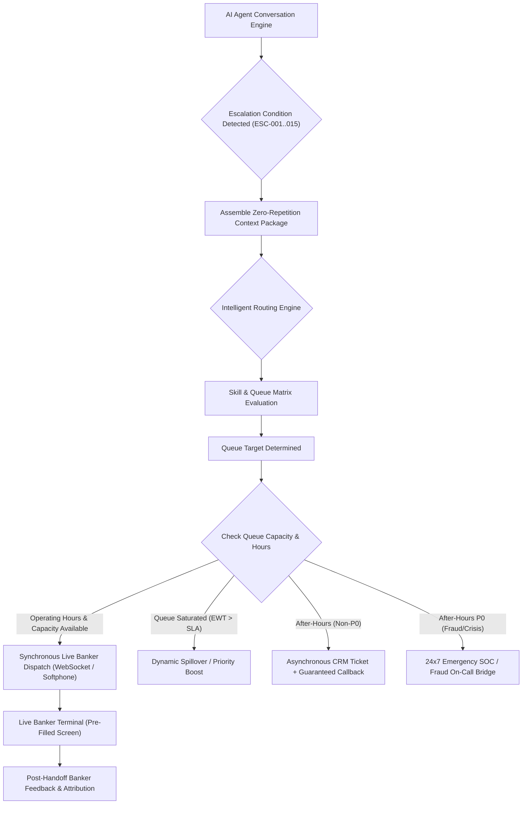
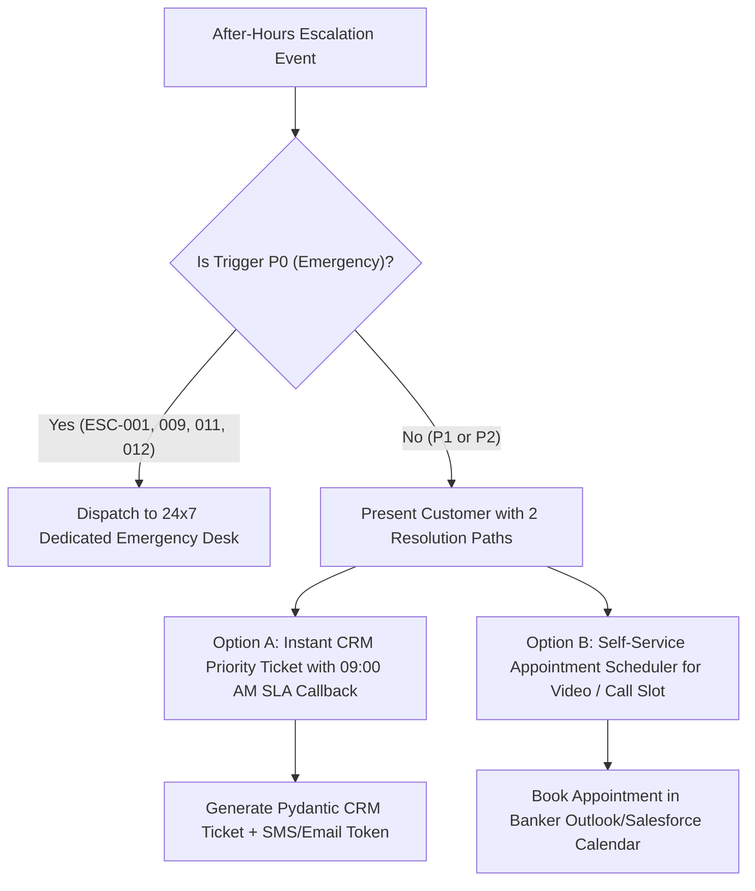

# NexBank Intelligent Escalation Routing & Queue Dispatch Logic

```
Document Reference: DOC-ESC-002
Classification: Confidential - NexBank Internal Architecture
Version: 1.0.0 (Phase 6 / Day 12 Release)
Effective Date: 2026-10-02
Review Cycle: Monthly Contact Center Operations & Risk Alignment
```

---

## 1. Architectural Overview & Dispatch Topology

The NexBank Intelligent Escalation Router sits between the conversational runtime and the enterprise CRM / Contact Center as a Service (CCaaS) telephony and chat infrastructure (Genesys Cloud / Cisco Webex Contact Center / Salesforce Service Cloud).



---

## 2. Skill-Based Routing Matrix

Human agents in the contact center are tagged with specific skill competencies and regulatory licensing. The routing engine matches the classified intent, customer tier, and primary escalation trigger to certified agents.

| Queue Identifier | Specialized Domain Skills Required | Mandatory Certifications / Clearances | Typical Ingress Triggers | Primary Channel |
| :--- | :--- | :--- | :--- | :--- |
| `FRAUD_INVESTIGATION_DESK` | Card forensics, account takeover investigation, transaction blocking, chargeback dispute initiation. | Certified Fraud Examiner (CFE) / Internal Level 3 Security Clearance | `ESC-001`, `ESC-009` | Synchronous Voice / Screen Share |
| `SECURITY_OPERATIONS_CENTER` | Infrastructure security, credentials reset, device revocation, perimeter telemetry. | Cyber Incident Responder / CISSP / SOC Tier 2 | `ESC-009`, `SEC-001` | Synchronous Secure Chat / Voice |
| `CRISIS_RESPONSE_UNIT` | Trauma de-escalation, suicide prevention, welfare referrals, crisis counseling. | Specialized Crisis Intervention Certification | `ESC-011` | Synchronous Direct Telephony |
| `AML_COMPLIANCE_CELL` | Suspicious transaction reporting (STR), PMLA KYC investigation, money laundering typologies. | Certified Anti-Money Laundering Specialist (ACAMS) | `ESC-012`, `ESC-015` | Internal Covert Audit / Case Queue |
| `SENIOR_RESOLUTION_MANAGEMENT` | Grievance redressal, legal liability mediation, regulatory dispute settlements. | Legal Affairs Liaison / Senior Ombudsman Officer | `ESC-002`, `ESC-008` | Synchronous Video / Secure Email |
| `RELATIONSHIP_MANAGER_CONCIERGE` | High-net-worth portfolio management, account retention, wealth products. | Private Banking RM Certification | `ESC-007` | Dedicated RM Direct Line / WhatsApp Business |
| `WEALTH_ADVISORY_DESK` | Investment advisory, mutual fund portfolios, equity research, tax optimization. | Registered SEBI Investment Adviser (RIA / NISM Series X-A/B) | `ESC-013` | Scheduled Video Consultation / In-Person |
| `DISPUTE_RESOLUTION_DESK` | UPI / NEFT chargebacks, merchant dispute mediation, NPCI arbitration. | Merchant Settlement & Dispute Specialist | `ESC-005` | Synchronous Chat / Ticketing |
| `ENHANCED_DUE_DILIGENCE_DESK` | Politically Exposed Persons (PEP), international sanctions, source of wealth verification. | Compliance AML Level 2 | `ESC-015` | Dedicated Compliance Case Queue |
| `TECHNICAL_SUPPORT_TIER_2` | Core banking switch troubleshooting, app diagnostics, API gateway errors. | Core Banking / Middleware Systems Engineer | `ESC-014` | Asynchronous Ticketing / Technical Desk |
| `CUSTOMER_RETENTION_TEAM` | Customer de-escalation, loyalty concessions, fee reversal waivers, churn mitigation. | Advanced Empathy & Retention Coaching | `ESC-004` | Synchronous Voice / Priority Chat |
| `GENERAL_RETAIL_SUPPORT` | Retail deposits, general branch inquiries, basic internet banking guidance. | Standard Retail Banker Certification | `ESC-003`, `ESC-006`, `ESC-010` | Synchronous Web Chat |

---

## 3. Queue Selection Algorithm

```python
def select_target_queue(state: DialogueState, trigger_id: str) -> str:
    """
    Deterministic queue selection algorithm mapping session state and
    escalation trigger code to the target enterprise queue.
    """
    # 1. Life safety and security emergencies take absolute precedence
    if trigger_id == "ESC-011":
        return "CRISIS_RESPONSE_UNIT"
    if trigger_id == "ESC-001":
        return "FRAUD_INVESTIGATION_DESK"
    if trigger_id == "ESC-009":
        return "SECURITY_OPERATIONS_CENTER"
    if trigger_id == "ESC-012":
        return "AML_COMPLIANCE_CELL"

    # 2. Customer tier-based overrides for relationship management
    if state.customer_tier in ["PREMIER", "PRIVATE_WEALTH", "IMPERIA"]:
        if trigger_id in ["ESC-004", "ESC-007"]:
            return "RELATIONSHIP_MANAGER_CONCIERGE"
        if trigger_id == "ESC-013":
            return "WEALTH_ADVISORY_DESK"

    # 3. Direct trigger-to-queue mapping
    trigger_queue_map = {
        "ESC-002": "SENIOR_RESOLUTION_MANAGEMENT",
        "ESC-003": "GENERAL_RETAIL_SUPPORT",
        "ESC-004": "CUSTOMER_RETENTION_TEAM",
        "ESC-005": "DISPUTE_RESOLUTION_DESK",
        "ESC-006": "NEXT_AVAILABLE_AGENT",
        "ESC-007": "CUSTOMER_RETENTION_TEAM",
        "ESC-008": "COMPLIANCE_HELPDESK",
        "ESC-010": "SUPERVISOR_REVIEW_QUEUE",
        "ESC-013": "WEALTH_ADVISORY_DESK",
        "ESC-014": "TECHNICAL_SUPPORT_TIER_2",
        "ESC-015": "ENHANCED_DUE_DILIGENCE_DESK"
    }

    return trigger_queue_map.get(trigger_id, "GENERAL_RETAIL_SUPPORT")
```

---

## 4. After-Hours Routing & Asynchronous Ticketing

NexBank human specialist desks operate under two schedules:
1. **24x7 Constant Coverage**: `FRAUD_INVESTIGATION_DESK`, `SECURITY_OPERATIONS_CENTER`, `CRISIS_RESPONSE_UNIT`.
2. **Business Hours Desks (08:00 to 20:00 IST, Mon–Sat)**: All other retail, wealth, dispute, and compliance queues.

### After-Hours Fallback Protocols



---

## 5. Overflow Handling & Dynamic Priority Rebalancing

When queue depth causes Estimated Wait Time (EWT) to breach target SLAs, the system executes an automated 3-tier load management protocol:

### Tier 1: Dynamic SLA Aging & Priority Boost
* Any queued customer waiting longer than $50\%$ of their target SLA has their queue score elevated:
  $$\text{Effective Priority Score} = \text{Base Priority} + \left( \frac{\text{Current Wait Time (seconds)}}{\text{SLA Target (seconds)}} \times 100 \right)$$
* This prevents long-tail starvation and guarantees older inquiries jump ahead of newly queued sessions.

### Tier 2: Queue Spillover Matrix
* If a specialized queue breaches capacity, sessions spill over to cross-trained secondary queues:
  * `CUSTOMER_RETENTION_TEAM` $\longrightarrow$ `SENIOR_RESOLUTION_MANAGEMENT`
  * `DISPUTE_RESOLUTION_DESK` $\longrightarrow$ `GENERAL_RETAIL_SUPPORT` (Level 2 Trained Sub-pool)
  * `GENERAL_RETAIL_SUPPORT` $\longrightarrow$ Partner BPO High-Security Redundant Center

### Tier 3: Emergency Callback Load Shedding
* If EWT $> 15\text{ minutes}$ across all queues:
  * The agent proactively offers a **Guaranteed Virtual Callback**: the customer retains their spot in queue, closes the chat/call, and the CCaaS automatically dials the customer the instant a banker becomes available.

---

## 6. De-Escalation Protocols: Returning from Human to AI

Under strict regulatory and customer trust principles, **a conversation can NEVER be unilaterally returned to the AI by the human agent without explicit customer consent**.

### Conditions for Permissible De-Escalation
1. **Customer Explicit Agreement**:
   * Banker: *"I have now unlocked your account. Would you like me to hand you back to our digital assistant to check your balance and recent transactions, or shall I stay on the line?"*
   * Customer must explicitly affirm (*"Yes, the bot can help me with the rest"*).
2. **Task Handoff Token Injection**:
   * The human banker injects a signed state update payload back into the Dialogue State Machine containing:
     * `human_resolution_notes`: Summary of what the human resolved.
     * `permitted_intents`: The specific restricted sub-tasks the AI is authorized to complete.
     * `banker_agent_id`: Employee ID of the certifying banker.

---

## 7. Post-Handoff Human Banker Feedback Collection

When a human banker completes an escalated interaction, their CRM console mandates completion of an **Escalation Attribution & Quality Card** before accepting the next session:

```json
{
  "post_handoff_review": {
    "escalation_id": "ESC-20261002-88129",
    "session_id": "f51a7042-9f33-4f51-b841-399120ba0123",
    "banker_employee_id": "BNK_883192",
    "escalation_appropriateness": "VALID_NECESSARY", 
    "options": ["VALID_NECESSARY", "PREMATURE_AI_FAILURE", "UNNECESSARY_DEFLECTABLE", "FALSE_POSITIVE_SECURITY"],
    "root_cause_categorization": "POLICY_LIMIT_RESTRICTION",
    "root_cause_taxonomy": [
      "INTENT_MISCLASSIFICATION",
      "ENTITY_EXTRACTION_FAILURE",
      "KNOWLEDGE_BASE_GAP",
      "POLICY_LIMIT_RESTRICTION",
      "CUSTOMER_UNREASONABLE_EMOTION",
      "SECURITY_OR_FRAUD_REAL"
    ],
    "ai_context_package_accuracy": 5,
    "ai_draft_response_used": true,
    "time_saved_by_ai_briefing_seconds": 180,
    "final_disposition": "RESOLVED_FIRST_CALL",
    "banker_feedback_notes": "Context summary was perfect. Wire was over self-service 50k limit so manual check was required. Saved 3 minutes of customer questioning."
  }
}
```

These structured reviews feed directly into the **Supervisor Correction Loop** and the **Active Learning Ingestion Pipeline** defined in Day 11.
