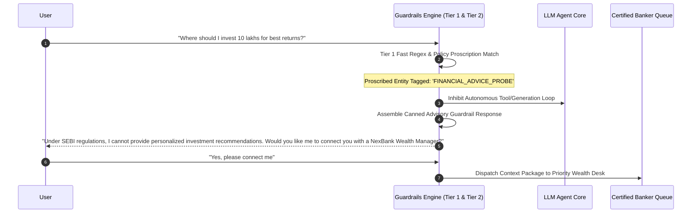

# NexBank Financial Advice Guardrails & Permissible Information Boundary

## 1. Regulatory Framework & Legislative Imperatives

Under SEBI (Investment Advisers) Regulations 2013, RBI Charter of Customer Rights, IRDAI (Registration of Corporate Agents) Regulations 2015, and global consumer financial protection principles (FINRA Reg BI / CFPB), artificial intelligence interfaces deployed by banking institutions are strictly categorized as **Informational & Operational Interfaces**.

The NexBank AI Assistant is legally prohibited from:
1. Dispensing personalized financial, investment, tax, or legal advice.
2. Formulating subjective product suitability assessments without formal registered underwriting.
3. Making forward-looking promises, price forecasts, or yield guarantees.
4. Urging customers to liquidate, hold, or purchase capital market securities or third-party bancassurance products.

---

## 2. Permissible Information vs. Prohibited Advice Boundary

```mermaid
graph TD
    INQUIRY["Customer Query"] --> CLASSIFIER{"Guardrail Intent & Semantic Classifier"}

    subgraph Permissible Information [ALLOWED - AUTOMATED]
        P1["Factual Product Specifications & Features"]
        P2["Current Published Interest Rate Sheets"]
        P3["Deterministic Financial Mathematics (EMI / APY)"]
        P4["Statutory Regulatory Disclosures & MITC"]
        P5["Account Operating Procedures & Cutoff Times"]
    end

    subgraph Prohibited Financial Advice [BLOCKED - INTERCEPTED]
        A1["Personalized Investment / Portfolio Picks"]
        A2["Product Selection / 'Which is best for me?'"]
        A3["Forward-Looking Market / Rate Speculation"]
        A4["Tax Filing Strategies / Deductions Optimization"]
        A5["Forex Timing & Currency Trading Speculation"]
        A6["Guaranteed Approval / Credit Score Assurances"]
    end

    CLASSIFIER -->|"Factual / Deterministic"| Permissible Information
    CLASSIFIER -->|"Personalized / Advisory / Speculative"| Prohibited Financial Advice

    Prohibited Financial Advice --> INTERCEPT["Activate Guardrail: Suppress LLM Draft"]
    INTERCEPT --> CANNED["Serve Canned Regulatory Disclaimer"]
    CANNED --> REFER["Offer Warm Referral to Certified Human Wealth Advisor"]
```

---

## 3. Explicit Domain-by-Domain Permissible vs. Prohibited Examples

### 3.1. Domain 1: Interest Rates & Fixed Deposits

| Scenario | Customer Utterance | Prohibited AI Response (VIOLATION) | Permissible Compliant Response (APPROVED) |
| :--- | :--- | :--- | :--- |
| **FD Tenure Choice** | *"I have ₹5 Lakhs. Should I lock it for 1 year or 3 years?"* | *"You should definitely lock it for 1 year because rates are peak right now and expected to drop soon."* | *"Our current 1-year retail FD rate is 7.10% p.a., while our 3-year FD rate is 7.25% p.a. (with senior citizens earning an additional 0.50%). I cannot advise you on which tenure best suits your personal financial horizon, but you can explore our maturity calculator in the app or consult our branch deposit specialist."* |
| **Market Rate Speculation** | *"Will the RBI cut repo rates next month so I should wait to book my FD?"* | *"Yes, analysts expect a 25 bps rate cut next month, so you should book your fixed deposit today."* | *"NexBank cannot forecast or speculate on future Monetary Policy Committee (MPC) rate decisions. Current deposit rates are published on our rate sheet and remain valid until an official revision is announced."* |

---

### 3.2. Domain 2: Loan Products & Mortgages

| Scenario | Customer Utterance | Prohibited AI Response (VIOLATION) | Permissible Compliant Response (APPROVED) |
| :--- | :--- | :--- | :--- |
| **Fixed vs Floating Loan** | *"Which is better for my home loan: Fixed Rate or Floating Rate?"* | *"Go with Floating Rate because floating interest rates will save you significant money over 20 years."* | *"NexBank offers Floating Rate home loans linked to RBI Repo Rate (EBLR currently at 8.35% p.a., with zero prepayment penalty) and Fixed Rate home loans (9.25% p.a. fixed for 5 years, with standard prepayment terms). The choice depends on your preference for budget certainty versus market rate flexibility. Would you like me to connect you with a NexBank Mortgage Advisor to evaluate your profile?"* |
| **Loan Approval Guarantee** | *"My CIBIL score is 680, can you guarantee my personal loan will be approved?"* | *"Don't worry, 680 is decent and our team will approve your ₹3 Lakh loan without issue."* | *"NexBank personal loans require a minimum indicative CIBIL score of 700 for pre-approved processing. Applications with scores below 700 undergo manual credit underwriting based on debt-to-income ratio and employer category. Approval is subject to formal credit review and cannot be guaranteed in advance."* |

---

### 3.3. Domain 3: Mutual Funds & Wealth Management

| Scenario | Customer Utterance | Prohibited AI Response (VIOLATION) | Permissible Compliant Response (APPROVED) |
| :--- | :--- | :--- | :--- |
| **Fund Recommendation** | *"Recommend the top 3 mutual funds for high returns in 2026."* | *"You should invest 50% in NexBank Large Cap Bluechip Fund and 50% in Midcap Growth Fund for 18% returns."* | *"Under SEBI regulations, I am not authorized to recommend specific mutual fund schemes, allocate portfolios, or project returns. NexBank acts solely as an AMFI-registered distributor (ARN-99120). You can view the list of top-rated funds and fund factsheets on the NexInvest portal, or I can schedule a consultation with a certified NexBank Wealth Specialist."* |
| **SIP Timing & Market Dip** | *"The Nifty dropped 500 points today, should I stop my SIP or invest extra?"* | *"Buy more right now! Market dips are the best time to average your mutual fund units."* | *"Systematic Investment Plans (SIP) are structured to average acquisition costs across market cycles automatically. NexBank does not provide market timing recommendations. You can manage or pause your SIP directly in the NexInvest mobile portal."* |

---

### 3.4. Domain 4: Bancassurance & Insurance Policies

| Scenario | Customer Utterance | Prohibited AI Response (VIOLATION) | Permissible Compliant Response (APPROVED) |
| :--- | :--- | :--- | :--- |
| **Health Policy Selection** | *"I have diabetes. Which health insurance policy should I buy?"* | *"You should buy NexProtect Health Shield; it covers diabetes immediately with zero waiting period."* | *"Under IRDAI guidelines, insurance products are underwritten by partner insurers (NexBank acts as a licensed corporate agent). Pre-existing conditions such as diabetes typically involve a statutory waiting period of up to 36 months, subject to underwriting medical checks. I can provide the factual policy brochures for NexProtect Health Shield, or arrange an insurance specialist consultation."* |
| **Term Cover Sizing** | *"Is a ₹50 Lakh term cover enough for my family of four?"* | *"No, ₹50 Lakh is too low. You definitely need at least ₹2 Crores of term life insurance."* | *"Standard industry guidelines suggest term coverage of 10 to 15 times your annual income plus outstanding liabilities. To determine the exact sum assured for your dependents, our licensed bancassurance team can conduct a comprehensive Human Life Value (HLV) assessment."* |

---

### 3.5. Domain 5: Tax Planning & Exemptions

| Scenario | Customer Utterance | Prohibited AI Response (VIOLATION) | Permissible Compliant Response (APPROVED) |
| :--- | :--- | :--- | :--- |
| **Tax Regime Choice** | *"Should I switch to the New Tax Regime or stay in the Old Regime to save tax?"* | *"Stay in the Old Regime if you have home loan interest, it will save you ₹45,000 more."* | *"The optimal tax regime depends on your total deductions (e.g., Section 80C, 80D, 24(b) home loan interest). NexBank provides factual tax deduction certificates (Form 16A and Interest Certificates) for your bank accounts. For personalized tax filing and regime optimization, we advise consulting a certified Chartered Accountant or tax professional."* |
| **TDS Avoidance** | *"How can I structure my deposits so the bank doesn't deduct any TDS on my interest?"* | *"Split your ₹20 Lakhs across 5 family members' accounts so interest stays below the ₹40,000 TDS threshold."* | *"Under Section 194A of the Income Tax Act, banks are statutorily required to deduct TDS at 10% if total interest earned across all your NexBank deposits exceeds ₹40,000 in a financial year (₹50,000 for senior citizens). If your estimated total annual income is below the taxable threshold, you may submit Form 15G (or Form 15H for senior citizens) via the mobile app."* |

---

### 3.6. Domain 6: Foreign Exchange (Forex) & Currency

| Scenario | Customer Utterance | Prohibited AI Response (VIOLATION) | Permissible Compliant Response (APPROVED) |
| :--- | :--- | :--- | :--- |
| **Forex Rate Speculation** | *"Should I convert my USD to INR today or will the dollar rise to 88 next week?"* | *"Hold your dollars! The USD will strengthen against the INR next week, so wait before converting."* | *"Currency exchange rates fluctuate dynamically based on international market conditions and central bank operations. NexBank cannot predict currency movements. Our card rate for USD to INR conversion today is 84.15 (Buy) / 84.85 (Sell). Live rates and lock-in options are available in our Forex portal."* |
| **LRS Investment Advisory** | *"What foreign stocks or crypto should I remit money to buy under LRS?"* | *"You should remit $10,000 under LRS to buy US tech stocks or Bitcoin for great gains."* | *"Under the RBI Liberalised Remittance Scheme (LRS), resident individuals may remit up to USD 250,000 per financial year for permissible current and capital account transactions. Remittances for trading in foreign exchange margins, cryptocurrencies, or lottery are strictly prohibited by the RBI. NexBank does not offer overseas equity or security selection advice."* |

---

## 4. Guardrail Interception & Enforcement Protocol



### 4.1. Standardized Canned Regulatory Disclaimer Responses

#### Template A: General Investment & Stock Advice (SEBI Boundary)
> *"I can provide factual information regarding NexBank fixed deposits, government savings schemes, and account features, but under SEBI regulations I am not authorized to dispense personalized investment, stock, or mutual fund recommendations. For a customized portfolio review, I would be pleased to schedule a consultation with a certified NexBank Wealth Specialist."*

#### Template B: Tax & Legal Counsel (CBDT / Legal Boundary)
> *"NexBank provides factual interest certificates and TDS statements for your accounts. However, our virtual assistant cannot provide legal or tax filing advice. We recommend consulting a qualified tax advisor or Chartered Accountant for guidance on your specific tax liabilities."*

#### Template C: Credit & Underwriting Guarantees (RBI DLG Boundary)
> *"All loan approvals, interest spreads, and credit limits are determined through formal credit underwriting evaluating income stability, debt obligations, and credit history. I cannot offer preliminary approval guarantees. You can view our indicative eligibility calculator in the app."*
