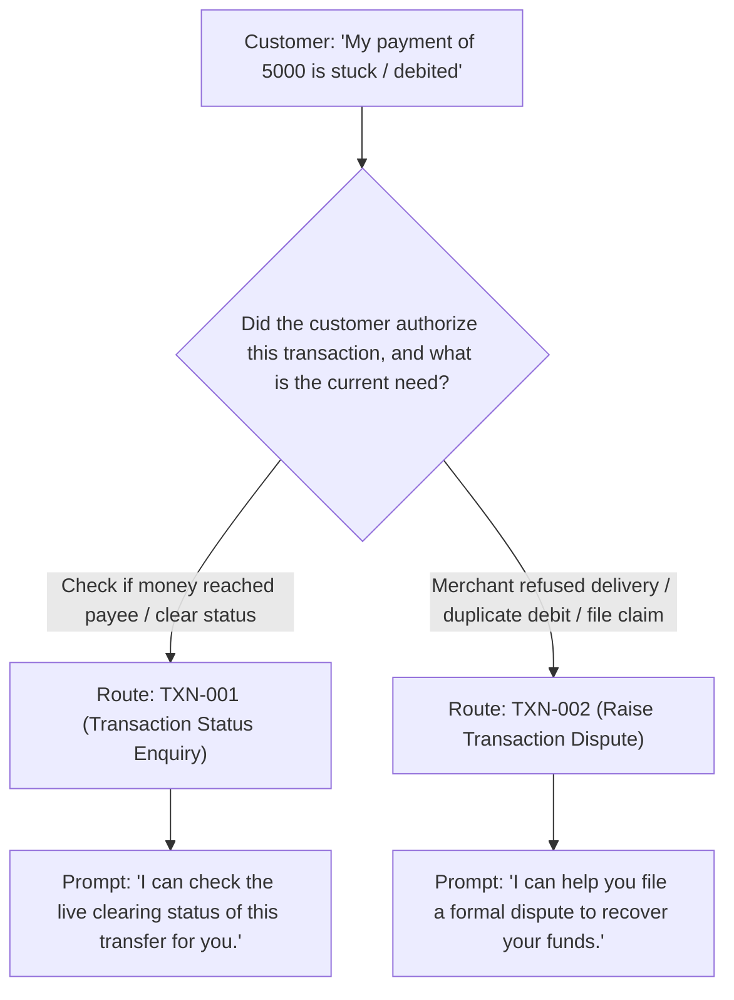
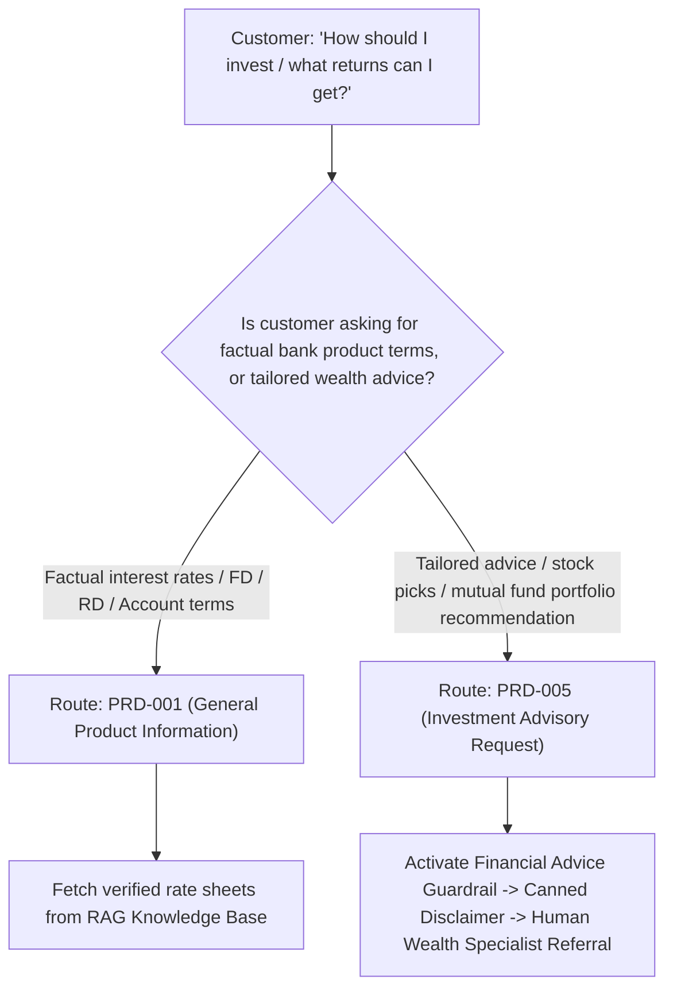
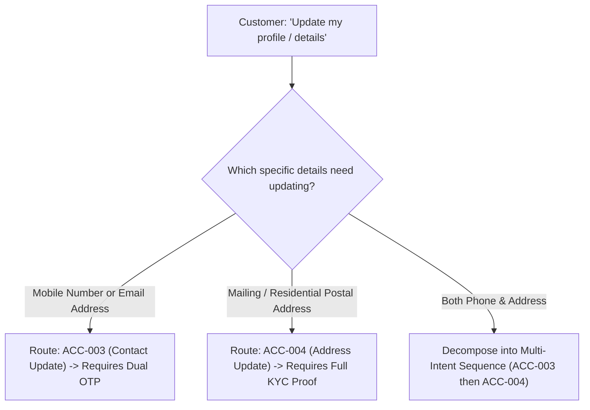
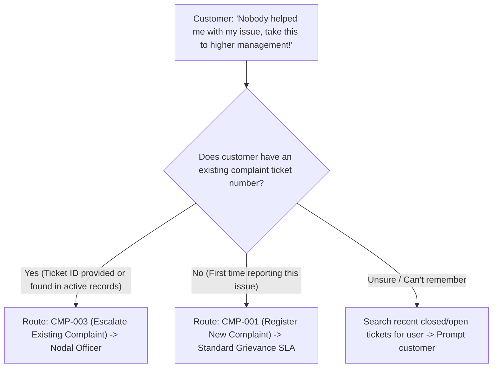
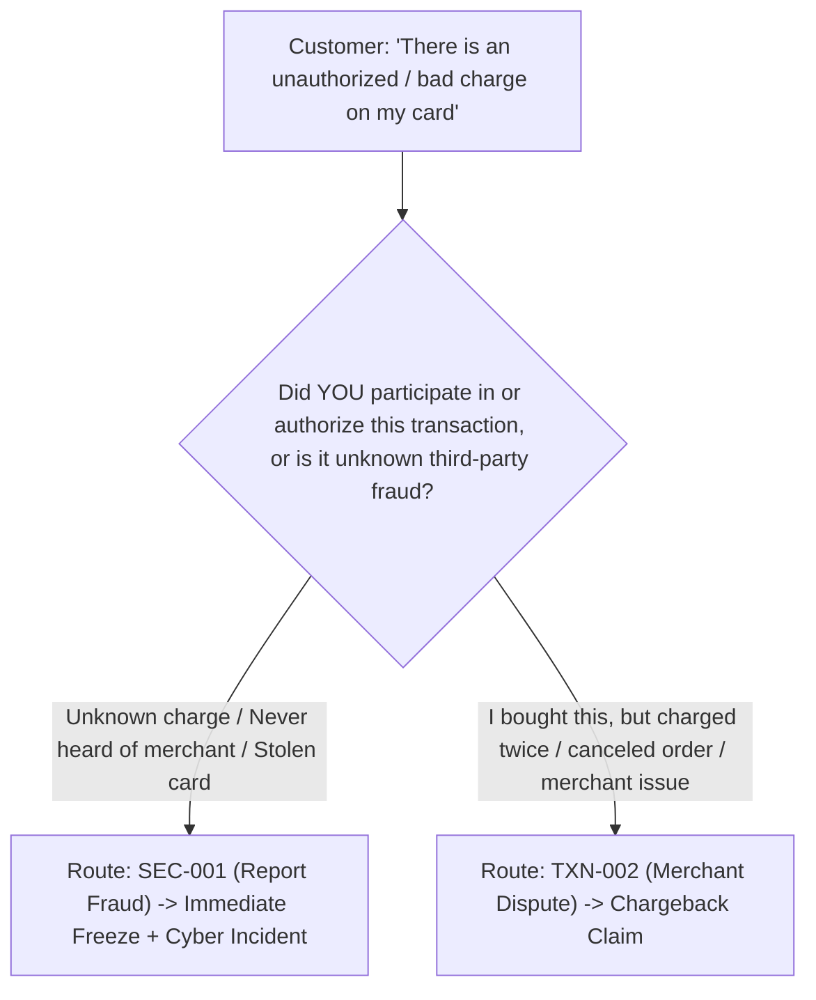
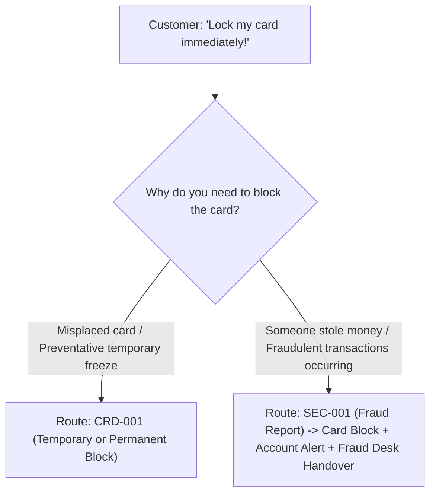
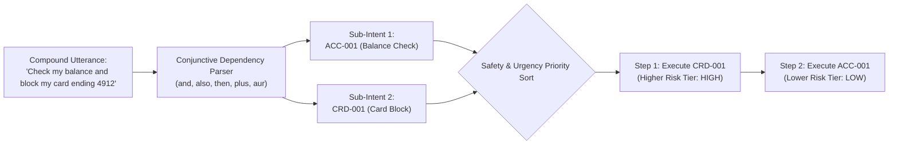

# NexBank Disambiguation Trees, Multi-Intent Handling & Fallback Policies

## 1. Disambiguation Framework

When a customer utterance displays semantic overlap between two closely related banking concepts, or when the NLU confidence margin between the top two intent candidates is narrow ($\Delta \le 0.15$ with confidence $0.65 \le c < 0.88$), deterministic disambiguation trees are invoked.

This document details decision trees for the 6 critical overlapping intent pairs, multi-intent decomposition protocols, out-of-scope (OOS) classification, and progressive fallback routines.

---

## 2. Decision Trees for the 6 Overlapping Intent Pairs

### 2.1. Pair 1: `TXN-001` vs `TXN-002` (Status Check vs. Dispute)
* **Semantic Ambiguity**: Utterance mentions a transaction problem (e.g., *"My transfer of 5000 to John is stuck and money got cut"*).
* **Core Distinction**:
  - `TXN-001`: Inquires whether the transfer is pending, successful, or scheduled for clearing.
  - `TXN-002`: Alleges wrong debit, merchant overcharge, or demands a formal chargeback.

* **Disambiguation Prompt**:
  > *"I can help you with this transaction. Would you like me to:*
  > *1. [Check Transfer Status] (See if the transfer is still processing or reversed)*
  > *2. [Raise a Formal Dispute] (Report duplicate debit or unfulfilled merchant service)*

---

### 2.2. Pair 2: `PRD-001` vs `PRD-005` (Information vs. Investment Advisory)
* **Semantic Ambiguity**: Utterance mentions returns, products, or yields (e.g., *"Where should I put my money for best returns?"* vs *"What are your savings account interest rates?"*).
* **Core Distinction**:
  - `PRD-001`: Factual retrieval of bank interest rates, terms, and features (RAG-compliant).
  - `PRD-005`: Request for tailored portfolio allocation or forward-looking investment picks (Prohibited by regulatory guardrails; must refer to human advisor).

* **Disambiguation Prompt**:
  > *"I can provide details on NexBank's guaranteed deposit rates, or connect you with a certified wealth advisor for personalized investment planning:*
  > *1. [View NexBank FD/Savings Rates] (Factual rates and yield calculators)*
  > *2. [Consult a Wealth Advisor] (Personalized portfolio and investment guidance)*

---

### 2.3. Pair 3: `ACC-003` vs `ACC-004` (Contact vs. Address Update)
* **Semantic Ambiguity**: Utterance mentions updating personal profile or KYC info (e.g., *"I moved and need to update my details"* or *"Change my phone and address"*).
* **Core Distinction**:
  - `ACC-003`: Digital contact vectors (Mobile Number, Email Address). Requires Dual-OTP step-up authentication.
  - `ACC-004`: Physical residential / correspondence postal address. Requires Full KYC documentation (Aadhaar OTP / Passport / OVD proof).

* **Disambiguation Prompt**:
  > *"Which contact or profile details would you like to update?*
  > *1. [Mobile Number or Email] (Fast verification via dual OTP)*
  > *2. [Residential Postal Address] (Requires valid address proof or Aadhaar OTP)*
  > *3. [Both]"*

---

### 2.4. Pair 4: `CMP-001` vs `CMP-003` (New Complaint vs. Escalation)
* **Semantic Ambiguity**: Utterance expresses strong dissatisfaction about an existing problem (e.g., *"No one solved my problem, this service is terrible, escalate this!"*).
* **Core Distinction**:
  - `CMP-001`: Registering a new grievance regarding branch, staff, charges, or app errors (generates new ticket).
  - `CMP-003`: Escalating an already registered grievance that has breached SLA or was resolved unsatisfactorily (escalates to Principal Nodal Officer).

* **Disambiguation Prompt**:
  > *"I am very sorry for this experience. To make sure your issue is directed to the right team:*
  > *1. [Escalate an Existing Ticket] (I have an unresolved complaint reference number)*
  > *2. [Register a New Formal Complaint] (Log a new grievance with our customer care team)*

---

### 2.5. Pair 5: `SEC-001` vs `TXN-002` (Fraud Report vs. Merchant Dispute)
* **Semantic Ambiguity**: Utterance reports money debited from account or card (e.g., *"Money was taken from my card for a transaction I don't agree with"*).
* **Core Distinction**:
  - `SEC-001`: Unauthorized third-party fraud, phishing, stolen card credentials, or cyber compromise (Immediate card lock + fraud ticket).
  - `TXN-002`: Legitimate merchant transaction where customer authorized payment, but merchant failed to deliver, charged twice, or refused refund.

* **Disambiguation Prompt**:
  > *"This sounds important. To take the correct security action immediately:*
  > *1. [Report Fraud / Unrecognized Charge] (You did NOT make this purchase; potential card compromise. We will freeze your card immediately)*
  > *2. [Dispute a Merchant Charge] (You recognize the merchant, but were overcharged, charged twice, or did not receive your order)*

---

### 2.6. Pair 6: `CRD-001` vs `SEC-001` (Card Block vs. Fraud Report)
* **Semantic Ambiguity**: Utterance requests card locking (e.g., *"Block my card right now!"*).
* **Core Distinction**:
  - `CRD-001`: Customer misplaced card, wants temporary freeze, or wants routine permanent block without unauthorized charges.
  - `SEC-001`: Card compromised by fraudsters, unauthorized OTPs received, or funds already stolen (Requires comprehensive account freeze + fraud investigation).

* **Disambiguation Prompt**:
  > *"I can secure your card right away. Please let me know:*
  > *1. [Temporary or Standard Card Block] (Misplaced card, travel lock, or ordering replacement)*
  > *2. [Card Compromised / Fraud Incident] (Unauthorized charges or suspicious activity detected)*

---

## 3. Multi-Intent Extraction & Sequence Processing

Customers frequently submit compound utterances containing two or more distinct requests. The NLU architecture handles these through **Multi-Intent Decomposition**:

### 3.1. Decomposition Pipeline

### 3.2. Prioritization Rules for Multi-Intent Sequences
When multiple intents are detected in a single turn, they are sorted by operational urgency and risk tier:
$$\text{CRITICAL (SEC-001, SEC-004)} > \text{HIGH (CRD-001, ACC-003, TXN-002)} > \text{MEDIUM} > \text{LOW (ACC-001, PRD-001)}$$

* **Execution Policy**:
  1. The urgent safety action is executed first (e.g., card freeze or fraud alert).
  2. The informational query is fulfilled immediately in the same response or as an immediate follow-up.
  3. *Example Response*:
     > *"1. Security Action: Your debit card ending in 4912 has been temporarily blocked immediately.*
     > *2. Account Balance: Your primary savings account balance is ₹48,250.00.*
     > *Is there anything else I can assist you with?"*

---

## 4. Out-of-Scope (OOS) Detection & Fallback Routines

### 4.1. Out-of-Scope Taxonomy
Utterances that do not map to the 30 banking intents are classified into distinct OOS categories:
* `OOS_CHITCHAT`: Pleasantries, greetings (*"Hello"*, *"How are you"*, *"Who made you"*). Handled with polite conversational banking personas.
* `OOS_UNRELATED`: General knowledge, weather, cooking, entertainment (*"What is the capital of France?"*, *"Write a poem"*). Handled with gentle redirection:
  > *"I am NexBank's dedicated virtual assistant, specifically trained to help you with your banking, accounts, cards, and payments. How can I assist you with your banking needs today?"*
* `OOS_PROHIBITED_ADVICE`: Legal, medical, or political queries (*"Should I sue my landlord?"*). Handled with clear domain boundary statements.
* `OOS_MALICIOUS`: Jailbreaks, prompt injections, and profanity. Handled by Layer 1/2 Guardrails.

### 4.2. Progressive Fallback & Probing Protocol
When confidence is below the low-confidence threshold ($c < 0.65$):
1. **Fallback Turn 1 (Clarification Probe)**:
   - Does not state generic confusion. Instead, identifies closest semantic domain:
   > *"I want to make sure I understand correctly. Are you looking for help with an Account, a Card, or a Recent Transaction?"*
   - Presents top domain buttons: `[Accounts]` `[Cards]` `[Transactions & UPI]` `[Other]`.
2. **Fallback Turn 2 (Secondary Probing)**:
   - If user still fails classification:
   > *"I'm having trouble understanding your specific request. To avoid any delay or mistake with your banking, would you like me to connect you with a banking specialist right now?"*
   - Buttons: `[Connect to Live Specialist]` `[Try Again]`.
3. **Fallback Turn 3 (Hard Escalation)**:
   - Mandatory escalation triggers. Context package is packaged and session routes to Live Banker CRM.
