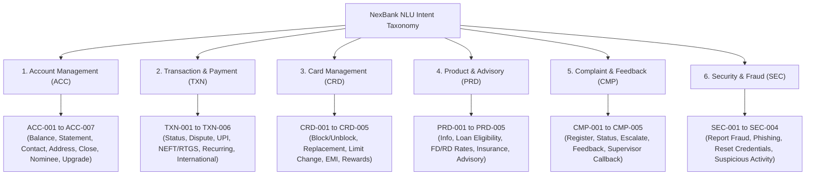

# NexBank Hierarchical Intent Taxonomy Specification

## 1. Executive Summary & Design Principles

The NexBank Natural Language Understanding (NLU) taxonomy implements a 3-tier hierarchical structure:
$$\text{Primary Domain} \longrightarrow \text{Secondary Subsystem} \longrightarrow \text{Tertiary Action / Leaf Intent}$$

This taxonomy governs intent classification across the retail and commercial banking surfaces. It explicitly aligns each intent with:
1. **Canonical Intent ID**: Unique alphanumeric reference (e.g., `ACC-001`, `TXN-003`).
2. **Deterministic Slots**: Required parameters (mandatory for transition to execution) and optional parameters (contextual enrichers).
3. **Authentication Tier**: Strict prerequisite authorization level (`ANONYMOUS`, `OTP_VERIFIED`, `BIOMETRIC_VERIFIED`, `FULL_KYC_VERIFIED`).
4. **Safety & Risk Rating**: Operational risk tier (`LOW`, `MEDIUM`, `HIGH`, `CRITICAL`), dictating guardrail checks, dual confirmation requirements, and audit log priority.

---

## 2. Global Hierarchy Overview (30 Intent Categories)

---

## 3. Detailed Intent Specifications (30 Categories)

### 3.1. Domain 1: Account Management (`ACC`)

#### `ACC-001`: Balance Check (`account.inquiry.balance`)
* **Description**: Inquire about current available balance, ledger balance, or uncleared deposits across savings, checking, or credit accounts.
* **Required Slots**: `account_type` (Default: `PRIMARY_CHECKING`).
* **Optional Slots**: `account_number_last4`, `currency`.
* **Authentication Level**: `OTP_VERIFIED`
* **Safety Rating**: `LOW`
* **Confirmation Required**: No.

#### `ACC-002`: Statement Request (`account.document.statement`)
* **Description**: Request generation and electronic delivery (email / PDF download / mobile view) of periodic bank account statements.
* **Required Slots**: `date_range` (e.g., `"last 3 months"`, `"April 2026"`).
* **Optional Slots**: `account_number_last4`, `delivery_channel` (Default: `REGISTERED_EMAIL`), `file_format` (Default: `PDF`).
* **Authentication Level**: `OTP_VERIFIED`
* **Safety Rating**: `LOW`
* **Confirmation Required**: No.

#### `ACC-003`: Contact Information Update (`account.profile.update_contact`)
* **Description**: Initiate a modification of registered mobile phone number or registered email address.
* **Required Slots**: `contact_field` (`EMAIL` | `PHONE`), `new_contact_value`.
* **Optional Slots**: `reason_for_change`.
* **Authentication Level**: `BIOMETRIC_VERIFIED`
* **Safety Rating**: `HIGH`
* **Confirmation Required**: Yes (Dual OTP sent to both old and new contact vectors + explicit confirmation).

#### `ACC-004`: Address Update (`account.profile.update_address`)
* **Description**: Initiate change of residential or correspondence postal address.
* **Required Slots**: `address_line_1`, `postal_pincode`, `city`, `state`.
* **Optional Slots**: `address_line_2`, `proof_of_address_type` (`AADHAAR_OTP` | `PASSPORT` | `UTILITY_BILL`).
* **Authentication Level**: `FULL_KYC_VERIFIED`
* **Safety Rating**: `HIGH`
* **Confirmation Required**: Yes (Requires biometric re-authentication or OVD upload review).

#### `ACC-005`: Account Closure Request (`account.lifecycle.close`)
* **Description**: Request closure of a savings, checking, or deposit account, and specify liquidation instructions for remaining balances.
* **Required Slots**: `account_number_last4`, `closure_reason`, `destination_account_for_residual_funds`.
* **Optional Slots**: `feedback_notes`.
* **Authentication Level**: `FULL_KYC_VERIFIED`
* **Safety Rating**: `CRITICAL`
* **Confirmation Required**: Yes (Mandatory warm handover to Retention Banker or branch appointment booking).

#### `ACC-006`: Nominee Update / Registration (`account.compliance.update_nominee`)
* **Description**: Add, update, or view registered nominee / beneficiary details for deposits under banking regulatory guidelines.
* **Required Slots**: `nominee_full_name`, `nominee_relationship`, `nominee_dob`.
* **Optional Slots**: `nominee_guardian_name` (if minor), `nominee_address`, `allocation_percentage`.
* **Authentication Level**: `BIOMETRIC_VERIFIED`
* **Safety Rating**: `MEDIUM`
* **Confirmation Required**: Yes.

#### `ACC-007`: Account Type Upgrade / Downgrade (`account.lifecycle.tier_change`)
* **Description**: Upgrade account tier (e.g., Regular Savings to NexBank Premier Wealth) or downgrade to Basic Savings Bank Deposit (BSBD).
* **Required Slots**: `target_tier` (`PREMIER` | `CLASSIC` | `SALARY_SELECT` | `BSBD`).
* **Optional Slots**: `current_account_number_last4`, `waiver_promo_code`.
* **Authentication Level**: `OTP_VERIFIED`
* **Safety Rating**: `MEDIUM`
* **Confirmation Required**: Yes (Explicit acceptance of Minimum Average Balance (MAB) / Average Monthly Balance (AMB) rules and fee schedules).

---

### 3.2. Domain 2: Transaction & Payment (`TXN`)

#### `TXN-001`: Transaction Status Enquiry (`transaction.inquiry.status`)
* **Description**: Check status of a specific debit, credit, or pending transfer (successful, failed, in-clearing, reversed).
* **Required Slots**: `transaction_identifier` (Reference ID, UTR number, or temporal cue: `"today's transfer"`).
* **Optional Slots**: `amount`, `beneficiary_name`, `date`.
* **Authentication Level**: `OTP_VERIFIED`
* **Safety Rating**: `LOW`
* **Confirmation Required**: No.

#### `TXN-002`: Raise Transaction Dispute (`transaction.dispute.raise`)
* **Description**: File a formal chargeback or dispute against an incorrect, duplicate, or unrecognized debit/POS/ATM charge.
* **Required Slots**: `transaction_id_or_reference`, `dispute_reason` (`DUPLICATE_DEBIT` | `MERCHANT_OVERCHARGE` | `ATM_CASH_NOT_DISPENSED` | `SERVICES_NOT_RECEIVED`).
* **Optional Slots**: `amount`, `merchant_name`, `supporting_evidence_url`.
* **Authentication Level**: `BIOMETRIC_VERIFIED`
* **Safety Rating**: `HIGH`
* **Confirmation Required**: Yes (Generates formal Dispute Ticket ID with statutory turnaround time SLA).

#### `TXN-003`: UPI Failure & Auto-Reversal Check (`transaction.upi.failure_inquiry`)
* **Description**: Inquire about money debited but not credited to recipient via UPI (Unified Payments Interface), and check NPCI auto-reversal status.
* **Required Slots**: `upi_transaction_ref` (12-digit UTR) or `amount` + `approx_timestamp`.
* **Optional Slots**: `payee_vpa`, `payer_vpa`.
* **Authentication Level**: `OTP_VERIFIED`
* **Safety Rating**: `LOW`
* **Confirmation Required**: No (Fetches NPCI real-time reversal sync status and RBI $T+1$ turnaround timeline).

#### `TXN-004`: NEFT / RTGS Transfer Status Check (`transaction.wire.neft_rtgs_status`)
* **Description**: Check clearing status, UTR number, and settlement batch for interbank domestic NEFT/RTGS transfers.
* **Required Slots**: `utr_number` or `beneficiary_account_last4` + `transfer_date`.
* **Optional Slots**: `amount`, `beneficiary_ifsc`.
* **Authentication Level**: `OTP_VERIFIED`
* **Safety Rating**: `LOW`
* **Confirmation Required**: No.

#### `TXN-005`: Recurring Payment Setup / Cancel (`transaction.mandate.manage`)
* **Description**: Create, pause, modify, or cancel e-mandates, Standing Instructions (SI), or AutoPay mandates (NACH/UPI AutoPay).
* **Required Slots**: `action_type` (`SETUP` | `PAUSE` | `CANCEL`), `mandate_identifier` (Merchant name or UMN number).
* **Optional Slots**: `frequency`, `max_debit_amount`, `end_date`.
* **Authentication Level**: `BIOMETRIC_VERIFIED`
* **Safety Rating**: `MEDIUM`
* **Confirmation Required**: Yes.

#### `TXN-006`: International Outward Remittance (`transaction.remittance.international`)
* **Description**: Initiate or check compliance status of cross-border SWIFT telegraphic transfers (LRS compliance in India / foreign exchange remittance).
* **Required Slots**: `swift_bic_code`, `beneficiary_iban_or_account`, `remittance_currency`, `remittance_amount`, `purpose_code`.
* **Optional Slots**: `intermediary_bank_details`, `source_account_last4`.
* **Authentication Level**: `FULL_KYC_VERIFIED`
* **Safety Rating**: `CRITICAL`
* **Confirmation Required**: Yes (Strict confirmation with live FX conversion rate, TCS tax applicability, and customer sign-off).

---

### 3.3. Domain 3: Card Management (`CRD`)

#### `CRD-001`: Block / Unblock Card (`card.security.block_unblock`)
* **Description**: Instantly freeze/lock or unfreeze/unlock a debit or credit card, or permanently block a compromised card.
* **Required Slots**: `card_last_four`, `action` (`TEMPORARY_BLOCK` | `PERMANENT_BLOCK` | `UNBLOCK`).
* **Optional Slots**: `reason` (`LOST` | `STOLEN` | `PREVENTIVE_LOCK` | `SUSPICIOUS_ACTIVITY`).
* **Authentication Level**: `OTP_VERIFIED` (for temporary freeze/permanent block); `BIOMETRIC_VERIFIED` (for unblocking).
* **Safety Rating**: `HIGH`
* **Confirmation Required**: Yes (Instant zero-delay execution with immediate confirmation message).

#### `CRD-002`: Card Replacement Request (`card.lifecycle.replace`)
* **Description**: Order a replacement debit or credit card following damage, expiry, or permanent blocking.
* **Required Slots**: `card_last_four`, `dispatch_address_type` (`PRIMARY_RESIDENCE` | `OFFICE` | `NEW_ADDRESS`).
* **Optional Slots**: `delivery_speed` (`STANDARD` | `EXPRESS`), `card_network_preference` (`VISA` | `MASTERCARD` | `RUPAY`).
* **Authentication Level**: `BIOMETRIC_VERIFIED`
* **Safety Rating**: `MEDIUM`
* **Confirmation Required**: Yes (Displays applicable reissue fee and masked delivery address for validation).

#### `CRD-003`: Credit Limit Change Request (`card.limit.modify`)
* **Description**: Request an increase in credit limit (based on pre-approved offers or income upload) or temporarily decrease credit/ATM cash limits.
* **Required Slots**: `card_last_four`, `target_limit_type` (`TOTAL_CREDIT_LIMIT` | `ONLINE_POS_LIMIT` | `ATM_WITHDRAWAL_LIMIT` | `INTERNATIONAL_LIMIT`), `requested_amount`.
* **Optional Slots**: `income_declaration`.
* **Authentication Level**: `BIOMETRIC_VERIFIED`
* **Safety Rating**: `MEDIUM`
* **Confirmation Required**: Yes.

#### `CRD-004`: Credit Card EMI Conversion (`card.billing.convert_emi`)
* **Description**: Convert eligible credit card purchases or full billing statement balances into monthly installment plans (EMI).
* **Required Slots**: `transaction_id_or_amount`, `tenure_months` (`3` | `6` | `9` | `12` | `24`).
* **Optional Slots**: `card_last_four`.
* **Authentication Level**: `OTP_VERIFIED`
* **Safety Rating**: `MEDIUM`
* **Confirmation Required**: Yes (Mandatory disclosure of interest rate, processing fees, GST, and monthly installment breakdown).

#### `CRD-005`: Reward Points Enquiry & Redemption (`card.rewards.inquiry_redeem`)
* **Description**: Inquire about reward points balance, points expiring, or redeem points for cash credit, vouchers, or merchandise.
* **Required Slots**: `card_last_four` (Default: all linked cards).
* **Optional Slots**: `action` (`CHECK_BALANCE` | `REDEEM_CASH` | `REDEEM_VOUCHER`), `points_to_redeem`.
* **Authentication Level**: `OTP_VERIFIED`
* **Safety Rating**: `LOW`
* **Confirmation Required**: Yes (only when points are debited for redemption).

---

### 3.4. Domain 4: Product & Advisory (`PRD`)

#### `PRD-001`: General Product Information (`product.inquiry.general_info`)
* **Description**: Ask factual questions about NexBank accounts, interest yields, fees, eligibility criteria, and digital banking services.
* **Required Slots**: `product_category` (`SAVINGS` | `CHECKING` | `FIXED_DEPOSIT` | `HOME_LOAN` | `PERSONAL_LOAN` | `CREDIT_CARDS`).
* **Optional Slots**: `product_feature_focus` (`FEES` | `INTEREST_RATES` | `ELIGIBILITY`).
* **Authentication Level**: `ANONYMOUS`
* **Safety Rating**: `LOW`
* **Confirmation Required**: No (Grounded strictly in verified RAG knowledge base).

#### `PRD-002`: Loan Eligibility & EMI Calculator (`product.loans.eligibility_calc`)
* **Description**: Calculate indicative loan eligibility, EMI schedules, and interest obligations based on customer income and desired borrowing amount.
* **Required Slots**: `loan_type` (`HOME_LOAN` | `AUTO_LOAN` | `PERSONAL_LOAN`), `loan_amount`, `tenure_years`.
* **Optional Slots**: `monthly_net_income`, `existing_emi_obligations`.
* **Authentication Level**: `ANONYMOUS`
* **Safety Rating**: `LOW`
* **Confirmation Required**: No (Mandatory disclaimer that calculation is indicative and subject to credit underwriting).

#### `PRD-003`: FD / RD Interest Rate Enquiry (`product.deposits.rate_inquiry`)
* **Description**: Retrieve current annualized interest rates, senior citizen premiums, and maturity value estimates for Fixed and Recurring Deposits.
* **Required Slots**: `deposit_type` (`FIXED_DEPOSIT` | `RECURRING_DEPOSIT`), `tenure_months_or_days`.
* **Optional Slots**: `deposit_amount`, `is_senior_citizen` (`true` | `false`).
* **Authentication Level**: `ANONYMOUS`
* **Safety Rating**: `LOW`
* **Confirmation Required**: No.

#### `PRD-004`: General Insurance Enquiry (`product.insurance.inquiry`)
* **Description**: Inquire about life, health, vehicle, and home insurance policies distributed by NexBank as a corporate bancassurance agent.
* **Required Slots**: `insurance_type` (`LIFE` | `HEALTH` | `MOTOR` | `HOME`).
* **Optional Slots**: `coverage_amount`, `age_bracket`.
* **Authentication Level**: `ANONYMOUS`
* **Safety Rating**: `LOW`
* **Confirmation Required**: No (Includes statutory disclaimer: *"Insurance is underwritten by third-party partner insurers. NexBank acts solely as a corporate agent."*).

#### `PRD-005`: Investment Advisory Request (`product.investments.advisory_request`)
* **Description**: Customer seeks personalized investment recommendations, mutual fund portfolio advice, equity stock trading advice, or market forecasts.
* **Required Slots**: `investment_goal` (`WEALTH_ACCUMULATION` | `RETIREMENT` | `TAX_SAVING`).
* **Optional Slots**: `investment_horizon`, `risk_profile`.
* **Authentication Level**: `ANONYMOUS`
* **Safety Rating**: `HIGH`
* **Confirmation Required**: Yes (Guardrail strictly prohibits autonomous AI advice; initiates warm referral to certified human Wealth Manager).

---

### 3.5. Domain 5: Complaint & Feedback (`CMP`)

#### `CMP-001`: Register Complaint (`complaint.lifecycle.register`)
* **Description**: Log a new customer grievance regarding branch staff, digital channel downtime, service delays, or disputed banking fees.
* **Required Slots**: `complaint_category` (`DIGITAL_CHANNELS` | `BRANCH_SERVICE` | `FEES_AND_CHARGES` | `ATM_ISSUES`), `description`.
* **Optional Slots**: `branch_code`, `incident_date`.
* **Authentication Level**: `OTP_VERIFIED`
* **Safety Rating**: `MEDIUM`
* **Confirmation Required**: Yes (Generates an official RBI Grievance Tracking Ticket with 7-day resolution SLA).

#### `CMP-002`: Check Complaint Status (`complaint.inquiry.status`)
* **Description**: Inquire about progress, investigation notes, or resolution outcome of an existing complaint.
* **Required Slots**: `complaint_ticket_id`.
* **Optional Slots**: None.
* **Authentication Level**: `OTP_VERIFIED`
* **Safety Rating**: `LOW`
* **Confirmation Required**: No.

#### `CMP-003`: Escalate Existing Complaint (`complaint.lifecycle.escalate`)
* **Description**: Escalate an existing, unresolved, or unsatisfactorily resolved complaint to the Principal Nodal Officer or Internal Ombudsman.
* **Required Slots**: `complaint_ticket_id`, `escalation_reason`.
* **Optional Slots**: `additional_documentation`.
* **Authentication Level**: `OTP_VERIFIED`
* **Safety Rating**: `HIGH`
* **Confirmation Required**: Yes (Flags ticket for Principal Nodal Officer review).

#### `CMP-004`: Customer Feedback Submission (`complaint.feedback.submit`)
* **Description**: Submit constructive feedback, CSAT rating, or suggestions regarding the AI assistant or banking services.
* **Required Slots**: `feedback_sentiment_rating` (`1` to `5` or `POSITIVE`/`NEGATIVE`).
* **Optional Slots**: `feedback_comments`, `feature_requested`.
* **Authentication Level**: `ANONYMOUS`
* **Safety Rating**: `LOW`
* **Confirmation Required**: No.

#### `CMP-005`: Request Supervisor Callback (`complaint.service.request_callback`)
* **Description**: Customer explicitly requests a voice or video callback from a human branch manager or senior customer service supervisor.
* **Required Slots**: `callback_contact_number`, `preferred_time_window`.
* **Optional Slots**: `topic_summary`.
* **Authentication Level**: `OTP_VERIFIED`
* **Safety Rating**: `MEDIUM`
* **Confirmation Required**: Yes (Confirms callback time slot with reference ID).

---

### 3.6. Domain 6: Security & Fraud (`SEC`)

#### `SEC-001`: Report Unauthorized Fraud / Compromise (`security.fraud.report_incident`)
* **Description**: Customer reports fraudulent debits, unauthorized net banking logins, stolen credentials, or cloned SIM card incidents.
* **Required Slots**: `affected_medium` (`CARD` | `NET_BANKING` | `UPI`), `approx_loss_amount`.
* **Optional Slots**: `transaction_id_list`, `incident_description`.
* **Authentication Level**: `DEVICE_RECOGNIZED` (Minimizes friction; enables instant lock before step-up).
* **Safety Rating**: `CRITICAL`
* **Confirmation Required**: No (Immediate defensive action: auto-freezes affected instruments and routes to Fraud Desk with top priority).

#### `SEC-002`: Report Phishing / Scam Message (`security.threat.report_phishing`)
* **Description**: Customer reports a fake SMS, WhatsApp scam link, spoofed email, or fraudulent phone call claiming to be NexBank.
* **Required Slots**: `phishing_channel` (`SMS` | `WHATSAPP` | `EMAIL` | `CALL`), `sender_details_or_link`.
* **Optional Slots**: `screenshot_url`, `message_text`.
* **Authentication Level**: `ANONYMOUS`
* **Safety Rating**: `LOW`
* **Confirmation Required**: No (Submits threat intelligence to the Bank Cyber Defense Unit).

#### `SEC-003`: Reset Digital Credentials (`security.credentials.reset_password`)
* **Description**: Initiate a secure password, MPIN, or transaction PIN reset for mobile or internet banking.
* **Required Slots**: `credential_type` (`NET_BANKING_PASSWORD` | `MOBILE_MPIN` | `DEBIT_CARD_PIN`).
* **Optional Slots**: `account_number_last4`.
* **Authentication Level**: `BIOMETRIC_VERIFIED`
* **Safety Rating**: `HIGH`
* **Confirmation Required**: Yes (Generates one-time hardware-bound secure link; agent never collects passwords directly).

#### `SEC-004`: Suspicious Activity Verification Response (`security.alert.verify_activity`)
* **Description**: Customer responds to an outbound bank fraud alert asking whether a flagged suspicious transaction was authorized (*"Yes, I did this"* or *"No, this was not me"*).
* **Required Slots**: `alert_reference_id`, `confirmation_status` (`AUTHORIZED` | `UNAUTHORIZED`).
* **Optional Slots**: `notes`.
* **Authentication Level**: `OTP_VERIFIED`
* **Safety Rating**: `CRITICAL`
* **Confirmation Required**: Yes (If `UNAUTHORIZED`, instantly initiates card blocking and transaction clawback).

---

## 4. Master Intent Summary Matrix

| Intent ID | Primary Domain | Name | Auth Level Required | Safety Rating | Default Action |
| :--- | :--- | :--- | :--- | :--- | :--- |
| **`ACC-001`** | Account Management | Balance Check | `OTP_VERIFIED` | `LOW` | Read API |
| **`ACC-002`** | Account Management | Statement Request | `OTP_VERIFIED` | `LOW` | Async Dispatch |
| **`ACC-003`** | Account Management | Contact Update | `BIOMETRIC_VERIFIED` | `HIGH` | Dual Verification |
| **`ACC-004`** | Account Management | Address Update | `FULL_KYC_VERIFIED` | `HIGH` | KYC Validation |
| **`ACC-005`** | Account Management | Account Closure | `FULL_KYC_VERIFIED` | `CRITICAL` | Handover / Retention |
| **`ACC-006`** | Account Management | Nominee Update | `BIOMETRIC_VERIFIED` | `MEDIUM` | Regulatory Form |
| **`ACC-007`** | Account Management | Tier Upgrade/Downgrade | `OTP_VERIFIED` | `MEDIUM` | Policy Disclosure |
| **`TXN-001`** | Transaction & Payment| Status Enquiry | `OTP_VERIFIED` | `LOW` | Read API |
| **`TXN-002`** | Transaction & Payment| Raise Dispute | `BIOMETRIC_VERIFIED` | `HIGH` | Dispute Workflow |
| **`TXN-003`** | Transaction & Payment| UPI Failure Check | `OTP_VERIFIED` | `LOW` | NPCI Sync Check |
| **`TXN-004`** | Transaction & Payment| NEFT/RTGS Status | `OTP_VERIFIED` | `LOW` | Settlement Batch Check |
| **`TXN-005`** | Transaction & Payment| Recurring Payment Setup/Cancel| `BIOMETRIC_VERIFIED`| `MEDIUM` | Mandate API |
| **`TXN-006`** | Transaction & Payment| International Remittance | `FULL_KYC_VERIFIED` | `CRITICAL` | FX / LRS Compliance |
| **`CRD-001`** | Card Management | Block/Unblock Card | `OTP` / `BIOMETRIC` | `HIGH` | Real-time Lock API |
| **`CRD-002`** | Card Management | Replacement Request | `BIOMETRIC_VERIFIED` | `MEDIUM` | Dispatch Order |
| **`CRD-003`** | Card Management | Limit Change | `BIOMETRIC_VERIFIED` | `MEDIUM` | Core Banking Limit API |
| **`CRD-004`** | Card Management | EMI Conversion | `OTP_VERIFIED` | `MEDIUM` | Installment Calculator |
| **`CRD-005`** | Card Management | Reward Points | `OTP_VERIFIED` | `LOW` | Reward Ledger API |
| **`PRD-001`** | Product & Advisory | Product Info | `ANONYMOUS` | `LOW` | Grounded RAG |
| **`PRD-002`** | Product & Advisory | Loan Eligibility Calc | `ANONYMOUS` | `LOW` | Deterministic Calc |
| **`PRD-003`** | Product & Advisory | FD/RD Rates | `ANONYMOUS` | `LOW` | Rate Sheet API |
| **`PRD-004`** | Product & Advisory | Insurance Enquiry | `ANONYMOUS` | `LOW` | Corporate Agent RAG |
| **`PRD-005`** | Product & Advisory | Investment Advisory | `ANONYMOUS` | `HIGH` | Human Wealth Referral |
| **`CMP-001`** | Complaint & Feedback| Register Complaint | `OTP_VERIFIED` | `MEDIUM` | Grievance Ticket API |
| **`CMP-002`** | Complaint & Feedback| Complaint Status | `OTP_VERIFIED` | `LOW` | Grievance Status API |
| **`CMP-003`** | Complaint & Feedback| Escalate Complaint | `OTP_VERIFIED` | `HIGH` | Nodal Officer Escalation |
| **`CMP-004`** | Complaint & Feedback| Feedback Submission | `ANONYMOUS` | `LOW` | Feedback Store |
| **`CMP-005`** | Complaint & Feedback| Supervisor Callback | `OTP_VERIFIED` | `MEDIUM` | Telephony Scheduler |
| **`SEC-001`** | Security & Fraud | Report Fraud | `DEVICE_RECOGNIZED` | `CRITICAL` | Urgent Defensive Freeze |
| **`SEC-002`** | Security & Fraud | Report Phishing | `ANONYMOUS` | `LOW` | Cyber Threat Log |
| **`SEC-003`** | Security & Fraud | Reset Credentials | `BIOMETRIC_VERIFIED` | `HIGH` | Out-of-band Reset Link |
| **`SEC-004`** | Security & Fraud | Verify Activity Alert | `OTP_VERIFIED` | `CRITICAL` | Fraud Intercept Action |
