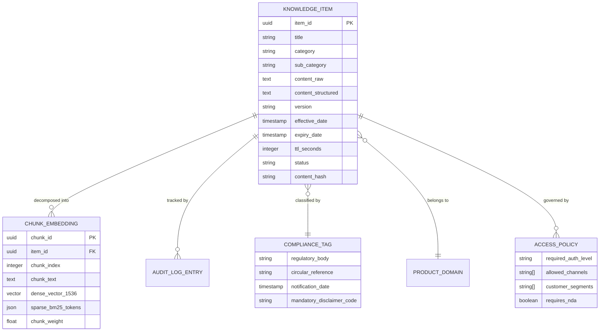

# NexBank Knowledge Base Entity-Relationship Schema & Metadata Specification

## 1. Executive Summary & Design Principles

The NexBank Knowledge Base (KB) serves as the authoritative, compliance-certified single source of truth for all customer-facing factual generation, policy citations, interest rates, troubleshooting steps, and regulatory disclosures. 

To eliminate hallucinations and guarantee legal compliance with financial regulators (RBI, SEBI, IRDAI, NPCI, PCI Security Standards Council), knowledge items are structured as strongly-typed, version-controlled relational entities. Every chunk contains cryptographic integrity verification, audit lineage, and access-control boundaries.

---

## 2. Entity-Relationship (ER) Architecture



---

## 3. Comprehensive Knowledge Item JSON Schema

The schema enforces strict validation via JSON Schema Draft 2020-12, mapped directly to Pydantic v2 domain models.

```json
{
  "$schema": "https://json-schema.org/draft/2020-12/schema",
  "title": "NexBankKnowledgeItem",
  "type": "object",
  "required": [
    "item_id",
    "title",
    "category",
    "sub_category",
    "content",
    "version",
    "effective_date",
    "regulatory_tag",
    "required_auth_level",
    "ttl_seconds",
    "access_control_flags",
    "verification_metadata"
  ],
  "properties": {
    "item_id": {
      "type": "string",
      "format": "uuid",
      "description": "Unique immutable identifier for the knowledge item"
    },
    "title": {
      "type": "string",
      "minLength": 5,
      "maxLength": 150,
      "description": "Descriptive title of the product, policy, or guide"
    },
    "category": {
      "type": "string",
      "enum": [
        "PRODUCT_SPECIFICATION",
        "INTEREST_RATES_FEES",
        "OPERATIONAL_POLICY",
        "REGULATORY_CIRCULAR",
        "TROUBLESHOOTING_GUIDE",
        "STANDARD_FAQ"
      ],
      "description": "Primary classification category"
    },
    "sub_category": {
      "type": "string",
      "enum": [
        "SAVINGS_ACCOUNTS",
        "FIXED_RECURRING_DEPOSITS",
        "CREDIT_CARDS",
        "HOME_LOANS",
        "PERSONAL_LOANS",
        "GOLD_LOANS",
        "INSURANCE_BANCASSURANCE",
        "MUTUAL_FUNDS_WEALTH",
        "UPI_DIGITAL_PAYMENTS",
        "NEFT_RTGS_SETTLEMENTS",
        "FRAUD_CYBER_DEFENSE",
        "GRIEVANCE_REDRESSAL"
      ]
    },
    "content": {
      "type": "object",
      "required": ["summary", "full_text", "structured_attributes"],
      "properties": {
        "summary": { "type": "string", "maxLength": 300 },
        "full_text": { "type": "string", "minLength": 50 },
        "structured_attributes": {
          "type": "object",
          "description": "Key-value attributes (e.g., interest_rate_pct, min_balance, fee_amount)"
        },
        "disclaimer_text": { "type": ["string", "null"] }
      },
      "additionalProperties": false
    },
    "version": {
      "type": "string",
      "pattern": "^\\d+\\.\\d+\\.\\d+$",
      "description": "Semantic version of the document (e.g. 2.1.0)"
    },
    "effective_date": {
      "type": "string",
      "format": "date-time",
      "description": "Timestamp when this policy/rate becomes legally valid"
    },
    "expiry_date": {
      "type": ["string", "null"],
      "format": "date-time",
      "description": "Timestamp when this item lapses; null if indefinite"
    },
    "regulatory_tag": {
      "type": "object",
      "required": ["primary_regulator", "circular_reference", "statutory_mandate"],
      "properties": {
        "primary_regulator": {
          "type": "string",
          "enum": ["RBI", "SEBI", "IRDAI", "NPCI", "PCI_DSS", "GOI_FINANCE", "INTERNAL_POLICY"]
        },
        "circular_reference": {
          "type": ["string", "null"],
          "description": "Official circular or notification number (e.g. RBI/2026-27/45)"
        },
        "statutory_mandate": { "type": "boolean" },
        "compliance_notes": { "type": ["string", "null"] }
      },
      "additionalProperties": false
    },
    "required_auth_level": {
      "type": "string",
      "enum": ["ANONYMOUS", "OTP_VERIFIED", "BIOMETRIC_VERIFIED", "FULL_KYC_VERIFIED"],
      "description": "Minimum customer authentication tier permitted to access this information"
    },
    "ttl_seconds": {
      "type": "integer",
      "minimum": 300,
      "description": "Cache time-to-live. Dynamic rates have shorter TTLs (e.g., 3600s); static FAQs have longer TTLs (e.g., 604800s)"
    },
    "access_control_flags": {
      "type": "object",
      "required": ["allowed_channels", "customer_segments", "is_confidential"],
      "properties": {
        "allowed_channels": {
          "type": "array",
          "items": { "type": "string", "enum": ["MOBILE_APP", "WEB_PORTAL", "TELEPHONY_IVR", "AGENT_DESKTOP"] }
        },
        "customer_segments": {
          "type": "array",
          "items": { "type": "string", "enum": ["RETAIL", "PREMIER_WEALTH", "COMMERCIAL_SME", "ALL"] }
        },
        "is_confidential": {
          "type": "boolean",
          "description": "If true, item is restricted to internal human banker terminals"
        }
      },
      "additionalProperties": false
    },
    "verification_metadata": {
      "type": "object",
      "required": ["content_owner_id", "compliance_approver_id", "approval_timestamp", "content_hash"],
      "properties": {
        "content_owner_id": { "type": "string", "format": "email" },
        "compliance_approver_id": { "type": "string", "format": "email" },
        "approval_timestamp": { "type": "string", "format": "date-time" },
        "content_hash": { "type": "string", "description": "SHA-256 hash of content body" }
      },
      "additionalProperties": false
    }
  },
  "additionalProperties": false
}
```

---

## 4. Indexing & Storage Engine Strategy

To support sub-200ms retrieval and high-concurrency queries:
1. **Primary Document Store (PostgreSQL 16)**:
   - Stores the full JSON document, relational tags, and audit history.
   - Uses `tsvector` columns with GIN indexing for high-speed lexical full-text filtering over banking terms.
2. **Vector Store (Pinecone Enterprise & Local ChromaDB)**:
   - Indexes text chunks decomposed using RecursiveCharacterTextSplitter (chunk size: 512 tokens, overlap: 64 tokens).
   - Embedding dimensionality: 1,536 dimensions (normalized for cosine distance).
   - Metadata payload contains `item_id`, `category`, `sub_category`, `required_auth_level`, `regulatory_tag`, and `effective_date` for pre-filtering.
3. **In-Memory Cache (Redis Enterprise)**:
   - High-velocity rate sheets (e.g. current FD rates, gold rates) cached directly with Redis string keys keyed by `kb:rate:<sub_category>`.
