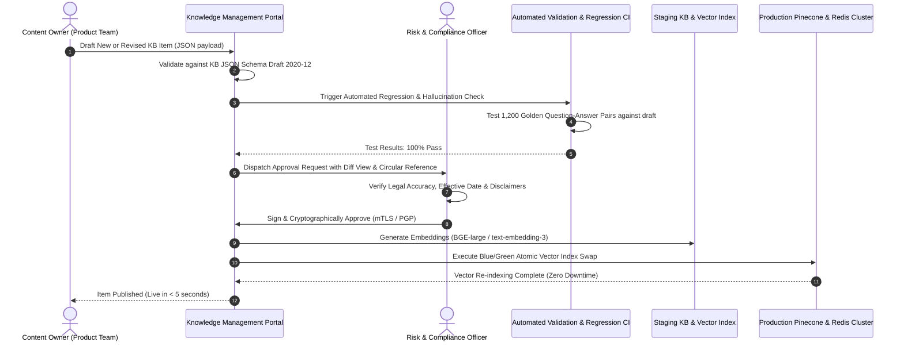
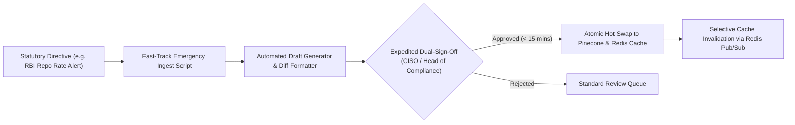
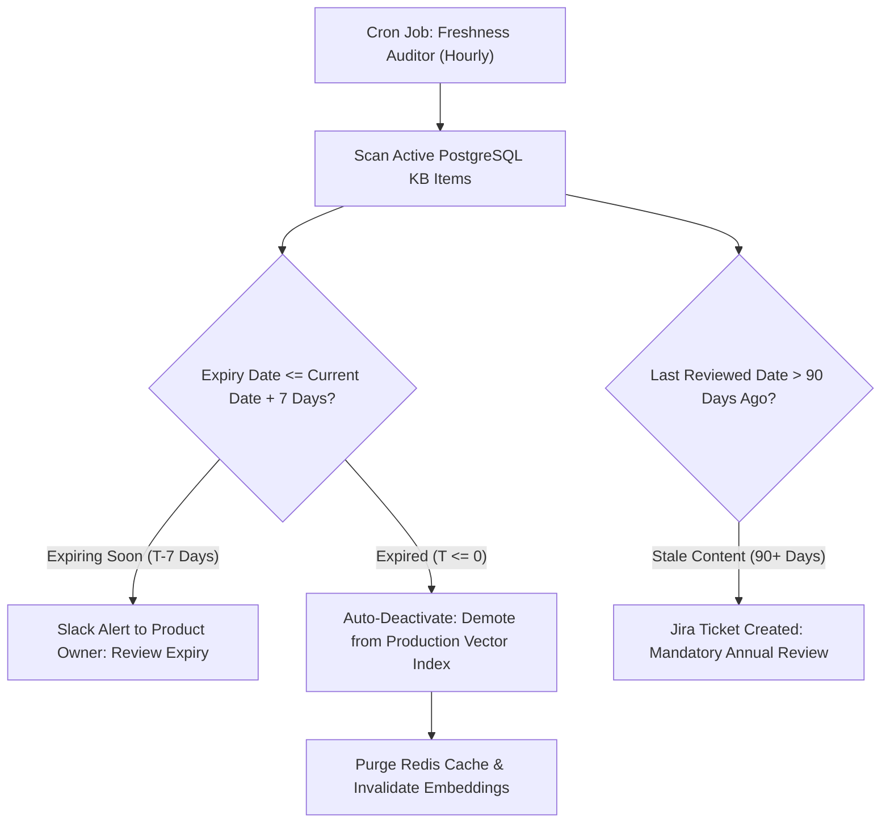

# NexBank Knowledge Base Maintenance & Regulatory Update Procedures

## 1. Executive Summary & Governance Model

To prevent outdated banking policies, ungrounded answers, or regulatory non-compliance from reaching customers, the NexBank Knowledge Base (KB) operates under strict **Continuous Governance**. 

No content modification, rate change, or regulatory disclosure is published to the live RAG vector store without cryptographic verification and dual-approval sign-off. This document establishes:
1. The **Standard Dual-Approval Workflow** (Content Owner + Compliance Officer).
2. The **Fast-Track Emergency Pipeline** for same-day regulatory circulars (RBI, SEBI, IRDAI).
3. **Automated Freshness Monitoring, TTL Expiration, and Zero-Downtime Hot Swapping**.
4. **Instant Version Rollback Mechanisms**.

---

## 2. Standard Dual-Approval Update Workflow (Zero-Downtime)



### 2.1. Dual-Approval Operational Rules
1. **Separation of Duties**: The Content Owner who submits the draft and the Risk & Compliance Officer who signs off must be distinct individuals with verified IAM role permissions (`ROLE_KB_AUTHOR` vs `ROLE_KB_COMPLIANCE_SIGNER`).
2. **Cryptographic Lineage**: The published item records the SHA-256 hash of the content body and the digital signature timestamp of the approving officer.
3. **Automated Schema & Golden Suite Gate**: Any schema error, broken URL citation, or regression in the Golden Test Suite automatically rejects the submission before it reaches the compliance queue.

---

## 3. Fast-Track Emergency Pipeline (RBI / SEBI Statutory Directives)

When a regulator issues an emergency policy directive (e.g. an emergency Repo Rate cut, sanction list addition, or cyber vulnerability alert):



### 3.1. Fast-Track SLAs:
* **Detection & Draft Generation**: $\le 10\text{ minutes}$ from circular publication on the regulatory feed.
* **Compliance Sign-Off SLA**: $\le 15\text{ minutes}$ (escalated via priority SMS and PagerDuty to designated On-Call Compliance Officers).
* **Live Deployment & Vector Hot Swap**: $\le 30\text{ seconds}$ across all operational nodes via Redis Pub/Sub cache invalidation.

---

## 4. Automated Freshness Monitoring & TTL Expiration Alerts

Knowledge items are continuously audited by a background Kubernetes cron job (`nexbank-kb-freshness-monitor`) running every 60 minutes:



### 4.1. Freshness Rules:
1. **Dynamic Rate Sheets**: Interest rate cards have a mandatory maximum TTL of 30 days. If not re-certified by Treasury within 30 days, the item triggers an emergency warning.
2. **Auto-Deactivation**: Once `expiry_date` has passed, the item is automatically excluded from Pinecone and ChromaDB search filters via the active metadata filter clause:
   ```sql
   effective_date <= NOW() AND (expiry_date IS NULL OR expiry_date >= NOW())
   ```
   This ensures that no customer is ever quoted an expired promotional rate, even before physical re-indexing occurs.

---

## 5. Instant Version Rollback Mechanism

If a published knowledge item is found to contain a typographical error or inadvertent policy mistake:

### 5.1. Automated Rollback Protocol
1. **Single-Command Rollback**: Authorized administrators can execute:
   ```bash
   python -m nexbank.kb.manager rollback --item-id "00000001-0000-0000-0000-000000000006" --target-version "2026.09.1"
   ```
2. **Atomic Hot Swap Execution**:
   - The primary PostgreSQL store switches the `status` flag of version `2026.10.1` to `ROLLED_BACK` and restores version `2026.09.1` to `ACTIVE`.
   - Redis emits an invalidation event over the `kb:cache:invalidate` channel.
   - Vector store metadata updates the version filter immediately.
   - Total rollback time: **$< 3.0\text{ seconds}$** with zero conversational session disruption.
