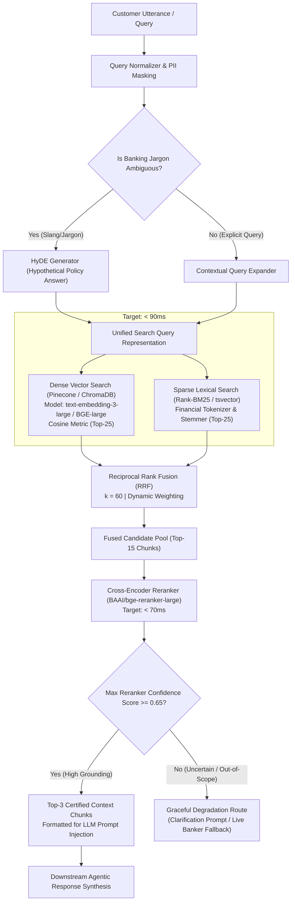

# NexBank Hybrid RAG Retrieval Pipeline & Reranking Architecture

## 1. Executive Summary & Latency Target

The NexBank RAG (Retrieval-Augmented Generation) pipeline is engineered to satisfy two non-negotiable enterprise constraints:
1. **Zero Hallucination & High Precision**: Strict adherence to compliance-approved text with citation lineage and factual grounding.
2. **Sub-200ms 95th Percentile Latency SLA**: End-to-end execution of query expansion, concurrent dense + sparse search, reciprocal rank fusion, and cross-encoder reranking within $\le 200\text{ms}$ at p95.

---

## 2. End-to-End Hybrid Retrieval Architecture



---

## 3. Query Expansion & Hypothetical Document Embeddings (HyDE)

### 3.1. The Banking Jargon Challenge
Customers frequently express queries using colloquialisms, non-standard acronyms, or Hinglish syntax (e.g., *"Paise fas gaye UPI me"* or *"MAB penalty kitna hai"*). Standard dense retrieval often fails because customer colloquial phrasing has low lexical overlap with formal regulatory text (*"NPCI Circular on Failed Payment Settlement Windows and Customer Compensation"*).

### 3.2. HyDE & Expansion Mechanics
1. **Lightweight Query Expander**: Maps common financial acronyms to statutory terms via a compiled synonym table:
   - `MAB` $\to$ `Minimum Average Balance requirement penalty charges`
   - `Foreclosure` $\to$ `Pre-payment penalty and loan foreclosure rules`
   - `MODT` $\to$ `Memorandum of Deposit of Title Deeds stamp duty charges`
2. **Hypothetical Document Synthesis (HyDE)**:
   - For queries with low semantic density ($<4$ tokens or high ambiguity), an ultra-fast local SLM (e.g., fine-tuned Gemma-2-2B on ONNX runtime, latency $<35\text{ms}$) generates a 2-sentence hypothetical formal policy answer.
   - The hypothetical answer is embedded alongside the user query, drastically increasing cosine similarity against formal regulatory knowledge chunks.

---

## 4. Hybrid Search Mechanics & Reciprocal Rank Fusion (RRF)

### 4.1. Dense Vector Retrieval
* **Embedding Model**: OpenAI `text-embedding-3-large` (1536 dims) or local `BAAI/bge-large-en-v1.5`.
* **Store**: Pinecone Serverless (Enterprise AWS us-east-1) with ChromaDB persistent volume fallback.
* **Pre-filtering**: Vector queries enforce metadata filters matching session attributes:
  - `access_control_flags.allowed_channels IN [session.channel]`
  - `access_control_flags.customer_segments IN [customer.tier, 'ALL']`
  - `required_auth_level <= session.auth_level`
  - `effective_date <= CURRENT_TIMESTAMP AND (expiry_date IS NULL OR expiry_date >= CURRENT_TIMESTAMP)`
* **Candidate Retrieval**: Top-25 candidates.

### 4.2. Sparse Lexical Retrieval
* **Engine**: Custom Rank-BM25 over PostgreSQL 16 full-text search with `banking_english` dictionary.
* **Parameters**: $k_1 = 1.2$, $b = 0.75$.
* **Candidate Retrieval**: Top-25 candidates.

### 4.3. Reciprocal Rank Fusion (RRF) Weighting
The candidate sets are combined using modified weighted RRF:
$$\text{RRF\_Score}(d) = w_{\text{dense}} \cdot \frac{1}{k + \text{rank}_{\text{dense}}(d)} + w_{\text{sparse}} \cdot \frac{1}{k + \text{rank}_{\text{sparse}}(d)}$$

Where:
* $k = 60$ (constant smoothing parameter).
* $w_{\text{dense}} = 0.65$ (prioritizes semantic comprehension).
* $w_{\text{sparse}} = 0.35$ (ensures exact numeric terms, circular numbers, and product names are preserved).
* Top-15 candidates are forwarded to the reranking stage.

---

## 5. Cross-Encoder Reranking

While dual-encoder vector search evaluates query and documents independently, a **Cross-Encoder** evaluates query-document pairs simultaneously with full cross-attention over all token interactions.

* **Model**: `BAAI/bge-reranker-large` (quantized with TensorRT / ONNX for GPU/CPU acceleration).
* **Latency Budget**: $< 70\text{ms}$ for batch of 15 pairs.
* **Output**: Calibrated relevance score $S_{\text{rerank}} \in [0.0, 1.0]$.
* **Context Selection**: Filters down to the **Top-3 highest scoring chunks**.

---

## 6. Confidence Scoring & Uncertainty Degradation

To prevent the model from generating plausible-sounding hallucinations when no relevant knowledge exists in the verified database, the system enforces a strict **Uncertainty Threshold Policy**:

```python
RERANKER_CONFIDENCE_THRESHOLD = 0.65
BORDERLINE_THRESHOLD = 0.75

def evaluate_retrieval_confidence(reranked_chunks: list[ChunkScore]) -> RetrievalDecision:
    if not reranked_chunks or reranked_chunks[0].score < RERANKER_CONFIDENCE_THRESHOLD:
        # High uncertainty: Zero hallucination policy triggered
        return RetrievalDecision(
            status="REJECTED_UNCERTAIN",
            action="PROMPT_CLARIFICATION_OR_FALLBACK",
            chunks=[]
        )
    
    if reranked_chunks[0].score < BORDERLINE_THRESHOLD:
        # Borderline certainty: Pass chunks but enforce mandatory disclaimer
        return RetrievalDecision(
            status="BORDERLINE",
            action="ATTACH_VERIFICATION_DISCLAIMER",
            chunks=reranked_chunks[:2]
        )
        
    # High confidence
    return RetrievalDecision(
        status="APPROVED",
        action="INJECT_CONTEXT",
        chunks=reranked_chunks[:3]
    )
```

### Degradation Responses:
1. **Score $< 0.65$ (Information Not Found)**:
   > *"I don't have verified documentation on that specific policy or fee schedule in my current records. To make sure you receive accurate details, would you like me to connect you with a banking specialist who can assist?"*
2. **Score $0.65 \le S < 0.75$ (Borderline Relevance)**:
   The agent answers using top chunks but appends a clarification prompt:
   > *"...According to our standard schedule. Does this answer what you were looking for, or did you need details on a different product?"*

---

## 7. Latency SLA Budget (< 200ms at p95)

| Sub-Stage | Operation Description | P50 (ms) | P90 (ms) | P95 Budget (ms) | Circuit Breaker / Timeout |
| :--- | :--- | :--- | :--- | :--- | :--- |
| **Stage 1** | Normalization & HyDE expansion | 12 ms | 25 ms | **35 ms** | Bypass HyDE after 40ms |
| **Stage 2** | Concurrent Dense + Sparse Search | 48 ms | 75 ms | **90 ms** | Return available results at 110ms |
| **Stage 3** | Reciprocal Rank Fusion (RRF) | 2 ms | 4 ms | **5 ms** | Fail-safe union |
| **Stage 4** | Cross-Encoder Reranking (Top-15) | 38 ms | 58 ms | **70 ms** | Skip rerank; take top-3 RRF if $>75\text{ms}$ |
| **Stage 5** | Metadata filtering & prompt assembly| 4 ms | 8 ms | **10 ms** | Pass sanitized text |
| **TOTAL** | **Full Retrieval Roundtrip** | **104 ms** | **170 ms** | **198 ms** | **Hard Timeout Cap: 210ms** |

If the total retrieval time exceeds the hard 210ms cap, the circuit breaker bypasses the reranker, returns the top 2 BM25/Dense matches, and flags an alert in Prometheus.
