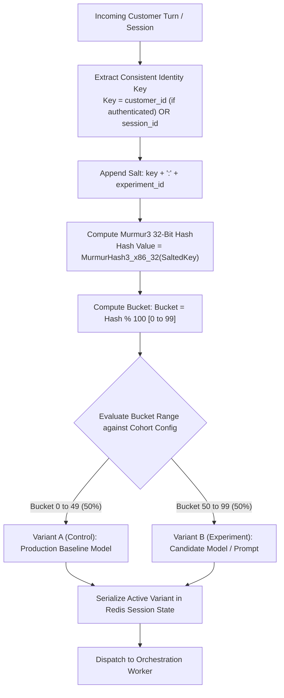
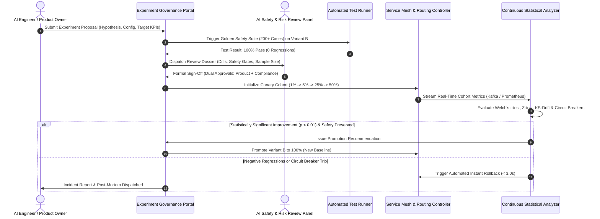

# NexBank A/B Testing & Experiment Governance Framework

## 1. Executive Summary & Experimentation Philosophy

To drive continuous conversational improvement without exposing bank operations or customer satisfaction to unvetted variants, all candidate prompts, retrieval configurations, and fine-tuned models must be evaluated through the **NexBank A/B Testing & Experiment Governance Framework**.

This framework guarantees:
1. **Deterministic Session Consistency**: Powered by **Murmur3 32-bit hashing**, ensuring a customer never experiences flipping model variants within a conversation or thread.
2. **Rigorous Statistical Verification**: Standardizing hypothesis testing ($p < 0.01$), minimum sample size sizing, and statistical power ($\beta = 0.80$) across four core banking KPIs.
3. **Formal Experiment Governance Workflow**: Structured approval lifecycle from proposal submission to Risk Panel review, canary deployment, and automated promotion/rollback.

---

## 2. Murmur3 Session-Consistent Traffic Allocation Architecture

### 2.1. Deterministic Hashing Formulation
Given user identifier $U$ (where $U = \text{customer\_id}$ if authenticated, else $\text{session\_id}$) and experiment salt $E$:
$$\text{HashValue} = \text{MurmurHash3\_x86\_32}(U \parallel \text{“:”} \parallel E, \; \text{seed}=2026)$$
$$\text{BucketIndex} = \text{HashValue} \pmod{100}$$

* **Invariant Guarantee**: A user in an active conversation will always resolve to the exact same bucket regardless of which stateless API Gateway pod handles the request.
* **Orthogonal Experimentation**: Different concurrent experiments use distinct experiment salts $E$, guaranteeing independent, uncorrelated user distributions across feature flags.

---

## 3. Statistical Power & Hypothesis Testing Formulas

All experiments run under a formal two-tailed hypothesis testing regime.

### 3.1. Primary KPI Evaluation Matrix

| Metric Name | KPI Type | Primary Goal | Baseline Benchmark | Target Minimum Detectable Effect (MDE) | Statistical Test Used |
| :--- | :--- | :--- | :--- | :--- | :--- |
| **CSAT Score** | Continuous $[1.0, 5.0]$ | Increase | $4.40 / 5.00$ | $+0.10$ points | Two-sample Welch's t-test |
| **Containment Rate** | Proportion (Binary) | Increase | $78.0\%$ | $+2.5\%$ (Absolute) | Two-sample Z-test for proportions |
| **First Contact Resolution (FCR)**| Proportion (Binary) | Increase | $82.0\%$ | $+2.0\%$ (Absolute) | Two-sample Z-test for proportions |
| **First Response Time (FRT)** | Continuous (ms) | Decrease | $650\text{ ms}$ | $-50\text{ ms}$ | Mann-Whitney U test (non-parametric) |

---

### 3.2. Minimum Sample Size Calculation ($N$)

#### For Binary Proportions (Containment Rate & FCR):
To detect an absolute minimum detectable effect $\delta = |p_B - p_A|$ with significance level $\alpha = 0.01$ (99% confidence) and statistical power $1 - \beta = 0.80$ (80% power):

$$N = \frac{\left(Z_{\alpha/2}\sqrt{2\bar{p}(1-\bar{p})} + Z_{\beta}\sqrt{p_A(1-p_A) + p_B(1-p_B)}\right)^2}{\delta^2}$$

Where:
* $Z_{\alpha/2} = Z_{0.005} = 2.576$ (Strict conservative critical value for banking compliance).
* $Z_{\beta} = Z_{0.20} = 0.842$ ($80\%$ power).
* $\bar{p} = \frac{p_A + p_B}{2}$.
* *Calculation Example*: For baseline $p_A = 0.78$ and target $p_B = 0.805$ ($\delta = 0.025$):
  $$N \approx 5,820 \text{ completed sessions per variant} \implies \text{Total } N_{\text{total}} \approx 11,640 \text{ sessions.}$$

#### For Continuous Metrics (CSAT Score):
$$N = \frac{2 \cdot \sigma^2 \cdot (Z_{\alpha/2} + Z_{\beta})^2}{\delta^2}$$

Where $\sigma \approx 0.85$ (historical standard deviation of CSAT) and $\delta = 0.10$:
$$N \approx \frac{2 \cdot (0.85)^2 \cdot (2.576 + 0.842)^2}{(0.10)^2} \approx 1,688 \text{ surveyed sessions per variant.}$$

* **Runtime Policy**: Experiments must run for a minimum duration of **7 full calendar days** (to account for day-of-week seasonality) and until the calculated minimum sample size $N$ is reached.

---

## 4. Experiment Governance Workflow

---

### 4.1. The 5 Formal Governance Stages

#### Stage 1: Proposal & Hypothesis Submission
* The experiment author submits an Experiment Proposal Document containing:
  1. Primary Hypothesis: *"Replacing few-shot exemplars with active-learning retrieved exemplars will increase card lock containment by 3%."*
  2. Primary and Guardrail KPIs.
  3. Pre-Experiment Power Sizing & Planned Sample Duration.
  4. Variant Diff (Prompt diff, NLU model artifact version, or RAG parameter config).

#### Stage 2: Automated Safety Gate & Risk Panel Review
* Before human review, CI/CD executes the **Golden Safety Benchmark Test Suite (200+ Cases)** against Variant B.
* If any case fails, the proposal is automatically rejected.
* If 100% pass, the proposal is presented to the **NexBank AI Safety Panel** (Lead AI Architect, Head of Compliance, and CISO Delegate) for dual-approval sign-off.

#### Stage 3: Phased Canary Launch
* Traffic is routed via Murmur3 hashing starting at 1% for 12 hours, progressing to 5% (24 hours), 25% (48 hours), and finally 50% split.

#### Stage 4: Continuous Statistical Monitoring
* Real-time Kafka consumer calculates running sample sizes, $p$-values, confidence intervals, and drift scores every 15 minutes.
* Automated circuit breakers monitor guardrail violations, drop-offs, and P99 latency.

#### Stage 5: Promotion & Rollback Criteria

| Outcome Condition | Statistical Threshold | Action Executed |
| :--- | :--- | :--- |
| **Clear Win (Promote)** | $p < 0.01$ on Primary KPI, no regression on guardrail KPIs, sample size $N$ satisfied. | Automated promotion of Variant B to 100% production baseline. |
| **Inconclusive (Neutral)** | $p \ge 0.01$ after 14 calendar days, no negative regressions. | Experiment concluded; Variant B discarded to prevent code clutter. |
| **Negative Regression (Rollback)** | Statistically significant drop ($p < 0.01$) in CSAT or containment rate. | Immediate automated rollback to Variant A within 3.0 seconds. |
| **Safety Breach (Hard Circuit Break)**| Single canary leakage, PII leak, or $>20\%$ surge in negative sentiment. | Emergency circuit breaker trips; traffic reverts instantly to 100% Control. |
