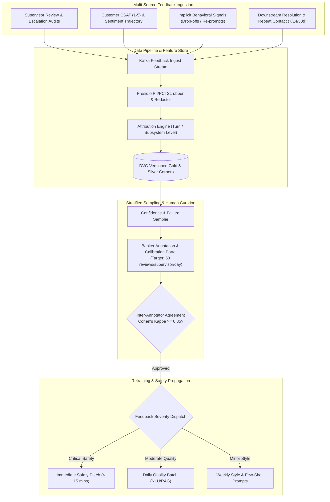
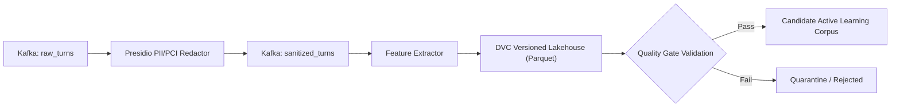

# NexBank Multi-Source Feedback Integration & Continuous Learning Data Pipeline

## 1. Executive Summary & Continuous Learning Architecture

In an enterprise banking environment, autonomous online fine-tuning presents an unacceptable operational and compliance risk. The NexBank platform enforces a **Closed-Loop Active Learning Architecture with Human-in-the-Loop Governance**. 

The system continuously captures, filters, and attributes multi-source feedback signals across three core feedback loops:
1. **Supervisor Correction Loop**: Expert human banker reviews and corrections.
2. **Customer Satisfaction (CSAT) Signal Engine**: Explicit ratings and implicit behavioral indicators.
3. **Resolution Outcome Engine**: Downstream repeat-contact tracking and ground-truth verification.



---

## 2. Core Feedback Integration Loop 1: Supervisor Correction Loop

### 2.1. Stratified Sampling Strategy
To maximize supervisor review efficiency, conversations are sampled via a stratified prioritization policy rather than uniform random selection:
1. **Confidence-Based Sampling (100% of borderline sessions)**:
   - Any session where NLU intent confidence fell between $0.65 \le c < 0.88$ or RAG reranker score was borderline ($0.65 \le S < 0.75$).
2. **Escalation-Triggered Sampling (100% of escalated sessions)**:
   - Every conversation transferred to a live banker terminal is audited alongside the banker's ultimate resolution notes.
3. **Complaint & Grievance Triggered (100% of `CMP` intents)**:
   - Any interaction involving `CMP-001` (Complaint) or negative CSAT survey responses ($\le 2$ stars).
4. **Random Benchmark Sampling (2.0% of all sessions)**:
   - Statistically random sampling of clean, self-service resolved sessions to monitor background false-positive resolutions and baseline health.

### 2.2. Error Severity Taxonomy & Action Timelines

| Severity Level | Definition & Scope | Example | Propagation Timeline & Action |
| :--- | :--- | :--- | :--- |
| **Level 1: Critical Safety Error** | Regulatory violation, PII leakage, unauthorized financial advice, or bypass of auth rules. | Agent projected 15% mutual fund returns or showed masked account to third party. | **Immediate Safety Patch ($< 15\text{ mins}$)**: Injects deterministic blocking regex into Layer 1 Guardrails; alerts SOC. |
| **Level 2: Moderate Quality Issue** | Incorrect intent classification, wrong entity slot extracted, or misleading policy chunk cited. | Customer said *"freeze my debit card"*, agent classified as *"order replacement card"*. | **Daily Quality Batch ($24\text{ hours}$)**: Retrains Rasa DIET NLU & adjusts RAG metadata chunk weights in nightly build. |
| **Level 3: Minor Style / Tone Mismatch** | Factually correct, but overly verbose, robotic, or lacking empathy in high-sentiment turns. | Long legal text returned to an upset customer reporting a lost wallet. | **Weekly Style Update ($7\text{ days}$)**: Updates few-shot in-context prompt exemplars and prompt guidelines. |
| **Level 4: False Positive Escalation** | AI unnecessarily escalated to a human specialist when standard self-service was capable. | Routine branch timing query escalated due to minor typo. | **Weekly Calibration**: Adjusts intent confidence margins and escalation proximity weights. |

### 2.3. Inter-Annotator Agreement & Workload Metrics
* **Inter-Annotator Calibration**: 10% of sampled sessions are independently cross-reviewed by two separate supervisors. Agreement is calculated using **Cohen's Kappa ($\kappa$)**:
  $$\kappa = \frac{p_o - p_e}{1 - p_e}$$
  - Minimum acceptable agreement threshold is $\kappa \ge 0.85$.
  - If $\kappa < 0.85$, a calibration review workshop is convened by the Quality Assurance Lead to standardize labeling criteria.
* **Supervisor Workload Target**: Calibrated at **50 session reviews per supervisor per working day** (~8 minutes per multi-turn session audit), supported by automated diff-highlighting tools in the Supervisor Review Console.

---

## 3. Core Feedback Integration Loop 2: Customer Satisfaction (CSAT) Signal Engine

### 3.1. In-Conversation Sentiment Trajectory Tracking
The sentiment engine computes real-time valence $v \in [-1.0, +1.0]$ and arousal $a \in [0.0, 1.0]$ on every turn using a fine-tuned RoBERTa sentiment model:
$$\Delta S_{\text{turn}} = v_{\text{current}} - v_{\text{previous}}$$
* **Deteriorating Trajectory**: 2 consecutive turns with $\Delta S_{\text{turn}} \le -0.30$ indicates escalating customer agitation.
* **Sentiment Slope**: Evaluated across a rolling 3-turn window:
  $$\text{Slope} = \frac{\sum_{i=1}^3 (i - \bar{x})(v_i - \bar{v})}{\sum_{i=1}^3 (i - \bar{x})^2}$$
  A slope $\le -0.25$ triggers proactive empathy prompt adjustment or escalation proximity increments.

### 3.2. Explicit Post-Interaction CSAT (1 to 5 Stars)
At the conclusion of a session, a lightweight native rating component is rendered:
* **Score 5 (Delighted)**: Instantaneous positive exemplar candidate for active learning.
* **Score 4 (Satisfied)**: Positive reinforcement; checked for minor friction points.
* **Score 3 (Neutral)**: Evaluated for turn count efficiency and response latency.
* **Score 1–2 (Dissatisfied)**: Dispatches mandatory survey probe (*"What went wrong?"* with options: `[Incorrect Answer]`, `[Difficult to Understand]`, `[Too Slow]`, `[Wanted Human Banker]`). Flagged for supervisor review.

### 3.3. Implicit Dissatisfaction Detection Without Explicit Feedback
Over 70% of digital banking customers abandon sessions without filling out surveys. The CSAT engine monitors implicit behavioral signals:
* **Frictionless Resolution**: Session concludes in $\le 4$ turns with affirmative closing tokens (*"thanks"*, *"got it"*, *"perfect"*, *"done"*, *"theek hai"*).
* **Frustrated Re-Prompting**: Customer repeats the exact same question with capitalization, aggressive punctuation (*"???!"*), or sarcastic lexical markers (*"are you a robot or what"*, *"useless"*).
* **Copy-Paste Repetition**: Exact duplicate text pasted $\ge 2$ times within 60 seconds indicates conversational impasse.
* **Rapid Rage Clicking / Drop-Off**: Customer abruptly terminates the session $<5$ seconds after an agent turn without completing the initiated transaction.

### 3.4. Root-Cause Feedback Attribution Engine
When dissatisfaction is detected, the **Attribution Engine** identifies which discrete subsystem failed:
1. **NLU Attribution**: Top intent confidence was $<0.80$ or required $>1$ disambiguation.
2. **RAG Knowledge Attribution**: Retrieved chunks had low reranker scores ($<0.72$) or user re-asked the question with different phrasing.
3. **Guardrail Attribution**: False-positive guardrail intercept triggered a generic canned response on a valid customer query.
4. **Latency Attribution**: Turn latency exceeded 2,500ms, inducing user frustration.

---

## 4. Core Feedback Integration Loop 3: Resolution Outcome Engine

### 4.1. Ground-Truth Resolution Categorization
Customer service interactions are tagged into 4 definitive outcome states:

```
+---------------------------------------------------------------------------------------------------+
| OUTCOME CATEGORY                  | DEFINITION & GROUND-TRUTH CONDITIONS                          |
+===================================+===============================================================+
| 1. resolved-first-contact (FCR)   | Self-service flow completed; explicit user confirmation;      |
|                                   | zero repeat contact on same topic within 72 hours.            |
+-----------------------------------+---------------------------------------------------------------+
| 2. resolved-with-escalation       | Transferred to live banker; banker marked ticket 'Resolved';  |
|                                   | customer satisfied; context package successfully utilized.    |
+-----------------------------------+---------------------------------------------------------------+
| 3. unresolved-dropped             | Customer abandoned session mid-flow during slot-filling;      |
|                                   | task uncompleted; customer logged in via web portal later.    |
+-----------------------------------+---------------------------------------------------------------+
| 4. false-resolution               | AI closed session claiming success, but customer contacted   |
|                                   | call center / branch on the exact same topic within 48 hours. |
+-----------------------------------+---------------------------------------------------------------+
```

### 4.2. Repeat Contact Longitudinal Tracking (7, 14, 30 Days)
The customer ID and issue category are indexed in TimescaleDB:
* **7-Day Repeat Window**: Evaluates transactional execution success (e.g. did a card replacement arrive, was an unfreeze executed). A repeat contact within 7 days flips the original session to `false-resolution`.
* **14-Day Repeat Window**: Monitors service-level disputes and fee refund appeals.
* **30-Day Repeat Window**: Audits recurring billing, mandate setups, and formal grievance resolutions.

---

## 5. Automated Data Ingestion, Scrubbing & Feature Engineering Pipeline

### 5.1. Data Ingestion Architecture
All conversation turns emit structured JSON events to Kafka topic `nexbank.conversations.raw`. An Apache Flink / Spark streaming job coordinates enrichment:



### 5.2. PII / PCI Scrubbing Guarantees
Before any utterance is stored in the training lakehouse:
* Microsoft Presidio Analyzer scans and anonymizes all PANs, CVVs, passwords, phone numbers, and names.
* Cryptographic surrogate tokens (e.g. `{{PCI_PAN_TOKEN_xxxx}}`) are replaced with static generic placeholders (`[CARD_NUMBER]`, `[CUSTOMER_NAME]`, `[DATE]`).
* Irreversible token hashing ensures training datasets contain **zero customer PII**.

### 5.3. Feature Engineering Schema
Each conversation is converted into an ML feature vector for active learning selection:
* `turn_count`: Total turns in dialogue.
* `avg_latency_ms`: Mean latency across turns.
* `sentiment_delta_total`: $v_{\text{end}} - v_{\text{start}}$.
* `disambiguation_count`: Number of clarification prompts presented.
* `rag_chunk_min_score`: Lowest cross-encoder rerank score in session.
* `final_outcome`: Ground-truth outcome category.

### 5.4. Dataset Versioning (DVC) & Data Quality Gates
All training datasets are tracked using **Data Version Control (DVC)** with Git-linked commit hashes (e.g. `dvc tag nlu-v2.4.0-20261002`).

#### Pre-Training Data Quality Gates:
1. **Class Balance Gate**: No single intent may constitute more than 15% or less than 1% of the fine-tuning split.
2. **Label Consistency Gate**: Cleanlab / confident learning algorithms scan the corpus; label ambiguity scores $>0.35$ are flagged for human re-annotation.
3. **Deduplication Gate**: Semantic embedding similarity $>0.98$ triggers deduplication to prevent model overfitting on repetitive phrasing.
