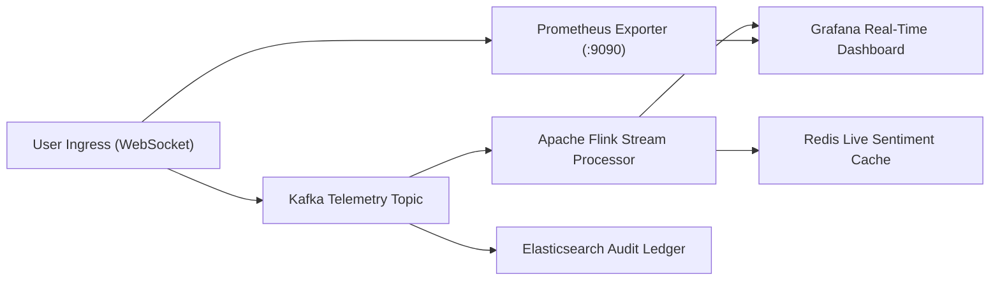

# NexBank Conversational AI Dashboard Wireframes & Observability Views

```
Document Reference: DOC-MET-002
Classification: Confidential - NexBank Internal Architecture
Version: 1.0.0 (Phase 6 / Day 13 Release)
Effective Date: 2026-10-02
Review Cycle: Monthly UI/UX Observability & Operations Alignment
Target System: Grafana Enterprise / Contact Center NOC Console / Datadog
```

---

## 1. Observability Architecture Overview

The NexBank Conversational AI platform provides three operational telemetry consoles tailored for different stakeholders:
1. **Real-Time Operations Dashboard (NOC & Duty Engineers)**: Real-time 5-second interval surveillance of ingress RPS, queue depths, live escalations, sentiment plunges, and security guardrail alerts.
2. **Daily Performance Dashboard (Contact Center Supervisors & Product Managers)**: 24-hour aggregate KPI trends, conversation funnel drops, top 10 unresolved intents, and supervisor correction breakdowns.
3. **Weekly Strategic Dashboard (Executive Leadership & Model Risk Officers)**: Week-over-week strategic benchmarks, active A/B experiment progress, knowledge base gap coverage, and model drift telemetry.

---

## 2. Dashboard 1: Real-Time Operations Dashboard

### Purpose & Refresh Rate
* **Primary Audience**: Network Operations Center (NOC), Contact Center Duty Managers, Security Operations Center (SOC).
* **Telemetry Refresh Rate**: 3 to 5 seconds via WebSockets / Prometheus polling.
* **Alert Trigger**: Audio-visual alert on any P0 escalation or surge in circuit breaker triggers.

### ASCII Wireframe Layout

```
+===================================================================================================================================+
| NEXBANK CONVERSATIONAL AI REAL-TIME OPERATIONS DASHBOARD                                 [2026-10-02 12:45:10 IST]  Status: HEALTHY|
+===================================================================================================================================+
| INGRESS & CONCURRENCY              | ACTIVE QUEUE DEPTH                | ESCALATION HEALTH                 | SAFETY & LATENCY     |
| Active Sessions:  4,821            | Fraud Desk (P0):      1 (00:45)   | 1h Containment:   78.4%           | p50 Latency:  1,120ms|
| Current Ingress:  42.5 req/s       | High-Value Wire (P1): 3 (02:10)   | Active Transfers: 42 sessions     | p95 Latency:  2,180ms|
| Peak Ingress 24h: 108.2 req/s      | Retail Care (P2):     14 (04:30)  | Escalation Rate:  21.6%           | p99 Latency:  2,890ms|
| System Uptime:    99.98%           | Callback Backlog:     5 queued    | SLA Compliance:   98.2%           | Guardrail FPR: 1.4%  |
+------------------------------------+-----------------------------------+-----------------------------------+----------------------+
| REAL-TIME INGRESS TRAFFIC (RPS - LAST 15 MINUTES)                      | REAL-TIME SENTIMENT HEATMAP (ACTIVE SESSIONS)            |
| 120|                                                                   | Sentiment Band | Active Sessions | Risk Level | Action    |
|  90|          /\        /\                                             | Positive (>=0.5)| 3,210 (66.6%)   | NORMAL     | None      |
|  60|   /\    /  \  /\  /  \    [Current: 42.5 RPS]                     | Neutral (0 to .4)| 1,180 (24.5%)  | NORMAL     | None      |
|  30|--/--\--/----\/- \/----\------------------------------------------ | Mild Neg (-.3 to 0)| 382 ( 7.9%)   | ELEVATED   | Empathy-1 |
|   0+------------------------------------------------------------------ | Deep Neg (<-0.7) |   49 ( 1.0%)   | CRITICAL   | P1 Escalate|
+------------------------------------------------------------------------+----------------------------------------------------------+
| ACTIVE ESCALATION TICKER (LIVE EVENT STREAM)                                                                                      |
| [12:45:08] [P0] [ESC-001 Fraud]          User #99812: Stolen Credit Card reported -> Routed to FRAUD_INVESTIGATION_DESK (SLA <2m) |
| [12:45:02] [P1] [ESC-005 Dispute > 50k]  User #44120: Disputed UPI Rs. 62,500  -> Routed to DISPUTE_RESOLUTION_DESK (SLA <5m)   |
| [12:44:51] [P2] [ESC-003 Low Conf x3]    User #77129: Unrecognized query x3    -> Routed to GENERAL_RETAIL_SUPPORT (SLA <10m)    |
| [12:44:30] [P0] [ESC-009 Unauth Access]  User #33108: OTP received unprompted  -> Routed to SECURITY_OPERATIONS_CENTER (SLA <2m) |
+-----------------------------------------------------------------------------------------------------------------------------------+
| REAL-TIME GUARDRAIL INTERVENTIONS & ANOMALY DETECTIONS (LAST 60 MINUTES)                                                          |
| Direct Prompt Injection Blocked: 12   | Financial Advice Refusal Rendered: 28   | Canary Token Leakage: 0 (ZERO) [NORMAL]        |
| Inactivity Session Terminations: 84   | PII Scrubber Redactions:          412   | DoS Payload Truncations: 4                     |
+===================================================================================================================================+
```

### Mermaid Architecture Topology of Real-Time Feeds



---

## 3. Dashboard 2: Daily Performance Dashboard

### Purpose & Cadence
* **Primary Audience**: Conversational AI Product Managers, Contact Center Operations Leads, NLP Engineers.
* **Cadence**: Daily roll-up generated at 00:00 UTC with drill-downs across previous 24 hours.

### ASCII Wireframe Layout

```
+===================================================================================================================================+
| NEXBANK CONVERSATIONAL AI DAILY PERFORMANCE REPORT                                     Date: 2026-10-02 (Past 24 Hours)           |
+===================================================================================================================================+
| TOTAL SESSIONS: 48,290      CONTAINMENT: 79.2%      CSAT: 4.54 / 5.0      FCR (72h): 73.8%      INCORRECT ADVICE: 0 (0.00%)       |
+-----------------------------------------------------------------------------------------------------------------------------------+
| 24-HOUR HOURLY INGRESS & CONTAINMENT TREND (%)                                                                                    |
| 100%|========================================================================= [Target: 70%]                                      |
|  80%|  81%  80%  78%  77%  79%  82%  84%  81%  79%  78%  76%  79%  80%  82%  83%                                                  |
|  60%|                                                                                                                             |
|     +--00---02---04---06---08---10---12---14---16---18---20---22-- (Hours IST)                                                  |
+-------------------------------------------------------------------+---------------------------------------------------------------+
| CONVERSATION FUNNEL & DROP-OFF ANALYSIS                           | SUPERVISOR FEEDBACK CORRECTION BREAKDOWN (50 SAMPLES AUDITED) |
| Total Ingress Conversations:           48,290 (100.0%)            | Total Audited Cases:                 50                       |
|   ├── Verified Authenticated Users:    39,114 ( 81.0%)            |   ├── Fully Approved (No Changes):   41 (82.0%)               |
|   ├── Completed in Self-Service:       38,245 ( 79.2%)            |   ├── Minor Style Edit (SEV-3):       6 (12.0%)               |
|   ├── Escalated to Human Banker:       10,045 ( 20.8%)            |   ├── Moderate Quality Issue (SEV-2): 3 ( 6.0%)               |
|   │     ├── P0 Security/Fraud Escal:    1,210 (  2.5%)            |   └── Critical Safety Error (SEV-1):  0 ( 0.0%)               |
|   │     ├── P1 Retention/High Value:    3,880 (  8.0%)            | Supervisor Inter-Annotator Agreement (Cohen's Kappa): 0.88    |
|   │     └── P2 Low Conf/Frequent Req:   4,955 ( 10.3%)            | Average Review Time per Interaction: 8.4 minutes              |
|   └── Customer Drop-Off / Abandon:        385 (  0.8%)            | Supervised Fine-Tuning Candidate Pairs Generated: 14 pairs    |
+-------------------------------------------------------------------+---------------------------------------------------------------+
| TOP 10 UNRESOLVED / ESCALATED INTENTS (ROOT CAUSE PARETO)                                                                         |
| Rank | Intent Code | Description                         | Volume | Escalation % | Primary Root Cause                          |
|  1   | TXN-003     | UPI Transaction Failure Dispute     | 2,140  | 62.4%        | Bank Switch Timeout (External NPCI Delay)   |
|  2   | ACC-004     | Address / Mobile Number KYC Update  | 1,820  | 44.1%        | In-Person Biometric Branch Requirement      |
|  3   | LOA-006     | Loan Foreclosure & NOC Issuance     | 1,120  | 78.5%        | Stamp Paper & Physical Lien Clearance       |
|  4   | CRD-002     | Replace Damaged / Lost Debit Card   |   980  | 24.2%        | Step-Up KYC Failure                         |
|  5   | TXN-006     | International Wire Remittance       |   850  | 88.0%        | Mandatory Form A2 FEMA Documentation Check  |
|  6   | DEP-004     | Premature Fixed Deposit Break       |   740  | 38.5%        | Penalty Clarification & Retention Offer     |
|  7   | ACC-005     | Savings Account Closure Request     |   610  | 92.1%        | Policy Mandate: RM Retention Transfer       |
|  8   | SEC-001     | Fraudulent Charge / Stolen Card     |   590  | 100.0%       | Policy Mandate: P0 Instant Human Escalation |
|  9   | INV-001     | Mutual Fund Purchase Inquiry        |   480  | 82.5%        | Policy Mandate: SEBI Refusal & Advisory Handoff |
| 10   | GEN-005     | Complex RBI Regulatory Clarification|   320  | 74.0%        | Missing Specific Vector Knowledge Chunk     |
+===================================================================================================================================+
```

---

## 4. Dashboard 3: Weekly Strategic Dashboard

### Purpose & Cadence
* **Primary Audience**: Chief Technology Officer (CTO), Chief Risk Officer (CRO), Head of Digital Banking.
* **Cadence**: Weekly executive briefing generated every Monday at 08:00 IST.

### ASCII Wireframe Layout

```
+===================================================================================================================================+
| NEXBANK CONVERSATIONAL AI WEEKLY STRATEGIC REVIEW                                      Week: 39 (2026-09-25 to 2026-10-01)        |
+===================================================================================================================================+
| WEEKLY SESSIONS: 324,800 (+4.2%)    CONTAINMENT: 79.8% (+1.4%)    CSAT: 4.58 / 5.0 (+0.04)    ESTIMATED SAVINGS: INR 4.82 Cr     |
+-----------------------------------------------------------------------------------------------------------------------------------+
| STRATEGIC KPI WEEK-OVER-WEEK BENCHMARK TRENDS                                                                                     |
| Metric Name                        | Target    | Last Week (W38) | This Week (W39) | Delta   | Compliance Status                   |
| Containment Rate                   | >= 70.0%  | 78.4%           | 79.8%           | +1.4%   | [MEETING BENCHMARK]                 |
| First Contact Resolution (FCR 72h) | >= 70.0%  | 72.1%           | 73.9%           | +1.8%   | [MEETING BENCHMARK]                 |
| CSAT (1-5 Scale)                   | >= 4.50   | 4.54            | 4.58            | +0.04   | [MEETING BENCHMARK]                 |
| Net Promoter Score (NPS)           | >= +50.0  | +52.1           | +54.8           | +2.7 pts| [MEETING BENCHMARK]                 |
| Prohibited Advice Breaches         | 0.00%     | 0.00%           | 0.00%           | 0.00%   | [100% REGULATORY IMMUTABLE]         |
| Average Handle Time (AI Sessions)  | < 5.0 min | 3.4 min         | 3.2 min         | -12 sec | [MEETING BENCHMARK]                 |
+-------------------------------------------------------------------+---------------------------------------------------------------+
| ACTIVE A/B EXPERIMENT PIPELINE (MURMUR3 COHORTS)                  | KNOWLEDGE BASE GAP ANALYSIS & COVERAGE                        |
| Exp ID: EXP-2026-Q4-L3-EMPATHY                                    | Approved Total KB Chunks:         1,482                       |
| Objective: Evaluate enhanced Hinglish empathy prompt variant      | Chunks Updated This Week:         48                          |
| Sample Size: Variant A: 14,200  | Variant B: 14,200               | Zero-Hit Customer Queries:        312 queries (0.09%)         |
| CSAT: Variant A: 4.52          | Variant B: 4.63 (+0.11)          | Top Emerging Uncovered Query:     "TDS deduction on NRE FD"   |
| Statistical Significance: p = 0.0028 (p < 0.01 threshold achieved)| Vector Similarity Average:        0.842 NDCG@3                |
| Status: Statistically Significant -> Promoted to 25% Canary       | Dual-Author Maker-Checker SLA:    4.2 hours average approval  |
+-------------------------------------------------------------------+---------------------------------------------------------------+
| CONTINUOUS LEARNING PIPELINE & MODEL DRIFT STATUS (KS DRIFT TEST)                                                                 |
| Model Checkpoint Active:   v0.5.0-alpha (LoRA Adapter-4819)       | DVC Dataset Version:             dvc-curated-2026-w39         |
| Golden Test Suite Pass:    200 / 200 (100.0% Pass Rate)           | New Verified Training Pairs:     340 dialogues                |
| Kolmogorov-Smirnov Stat:   D = 0.024 (p = 0.781)                  | Model Drift Evaluation:          NO DRIFT (Safe to Operate)   |
| Sub-3.0s Rollback Invocations: 0 (Zero rollbacks triggered)       | Next Risk Committee Audit Date:  2026-10-15                   |
+===================================================================================================================================+
```
