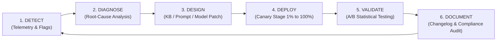

# NexBank Conversational AI KPI & Evaluation Framework

```
Document Reference: DOC-MET-001
Classification: Confidential - NexBank Internal Architecture
Version: 1.0.0 (Phase 6 / Day 13 Release)
Effective Date: 2026-10-02
Review Cycle: Monthly Executive Operations & Risk Governance Review
```

---

## 1. Executive Summary & Balanced Scorecard

The NexBank Agentic AI Customer Service Agent is governed by a **Tri-Dimensional Metrics Hierarchy**:
1. **Leading Indicators**: Real-time conversational signals measured mid-flight that predict success or failure before the dialogue terminates.
2. **Lagging Indicators**: Post-session outcome metrics measuring customer sentiment, resolution effectiveness, safety compliance, and business ROI.
3. **Operational Metrics**: Enterprise system resilience, infrastructure capacity, concurrency, and contact center workload distribution.

Together, these metrics fuel the **6-Stage Closed-Loop Improvement Cycle** that continuously refines model accuracy, retrieval coverage, and guardrail policies.

---

## 2. Leading Indicators (Predictive & In-Flight Metrics)

Leading indicators provide sub-second telemetry on the health of active conversations, enabling early mitigation and proactive escalation before customer dissatisfaction solidifies.

| Leading Indicator | Target Benchmark | Critical Breach Threshold | Measurement Methodology / Mathematical Formulation | Telemetry Source |
| :--- | :--- | :--- | :--- | :--- |
| **First Response Time (FRT)** | **$< 5.0\text{ seconds}$** | $> 8.0\text{ seconds}$ | Time from user message arrival at WebSocket ingress to rendering of the first token: $t_{\text{render}} - t_{\text{ingress}}$. | Envoy Gateway / OpenTelemetry |
| **Intent Recognition Accuracy** | **$\ge 92.0\%$** | $< 85.0\%$ | Macro-averaged top-1 intent classification accuracy evaluated on daily active learning test split: $\frac{\text{True Classified Intents}}{\text{Total Utterances}}$. | NLU Intent Engine |
| **Entity Extraction Accuracy** | **$\ge 95.0\%$** | $< 90.0\%$ | F1 score across all slot-filling parameters (Account Numbers, Amounts, Dates, Payees): $2 \cdot \frac{P \cdot R}{P + R}$. | Token Classification / SpaCy / LLM Parser |
| **Sentiment Trajectory Slope** | **$\ge 0.0$ (Neutral to Upward)** | Slope $< -0.25$ over 2 turns | Linear regression slope of turn-by-turn sentiment scores $S_t \in [-1.0, +1.0]$: $\beta_1 = \frac{\sum (t - \bar{t})(S_t - \bar{S})}{\sum (t - \bar{t})^2}$. Negative slope triggers empathy intervention. | Real-Time Sentiment Classifier |
| **KB Retrieval Relevance** | **$\ge 0.85$ MRR / NDCG@3** | $< 0.70$ | Mean Reciprocal Rank (MRR) and normalized discounted cumulative gain (NDCG@3) of retrieved vector chunks against query intent. | Qdrant / Hybrid BM25 Search Engine |
| **Guardrail False Positive Rate** | **$< 3.0\%$** | $> 5.0\%$ | Percentage of benign banking inquiries erroneously blocked or flagged as adversarial or policy breaches: $\frac{FP}{FP + TN}$. | NeMo / Llama-Guard Classifier Logs |
| **Agent Confidence Distribution** | **$\ge 80.0\%$ of turns with confidence $\ge 0.85$** | $> 15.0\%$ of turns with confidence $< 0.60$ | Probability density distribution of intent/tool classification confidence across active sessions. | Dialogue State Tracker |

---

## 3. Lagging Indicators (Outcome & Impact Metrics)

Lagging indicators measure the realized customer experience, safety record, and economic value generated by the platform.

| Lagging Indicator | Target Benchmark | Critical Breach Threshold | Measurement Methodology / Mathematical Formulation | Telemetry Source |
| :--- | :--- | :--- | :--- | :--- |
| **Customer Satisfaction (CSAT)** | **$\ge 4.5 / 5.0$** | $< 4.0 / 5.0$ | Arithmetic mean of post-interaction 1–5 Likert scale responses: $\frac{1}{N} \sum_{i=1}^N \text{Score}_i$. | Post-Session CSAT Engine |
| **Net Promoter Score (NPS)** | **$\ge +50.0$** | $< +30.0$ | Percentage of Promoters (9–10) minus percentage of Detractors (0–6) in monthly randomized relationship surveys: $\%P - \%D$. | Enterprise Voice-of-Customer Portal |
| **First Contact Resolution (FCR)** | **$\ge 70.0\%$** | $< 60.0\%$ | Percentage of inquiries where the customer does NOT initiate a subsequent contact across any banking channel within 72 hours for the same intent. | CRM Core Data Warehouse (72h window) |
| **Self-Service Containment Rate** | **$\ge 70.0\%$** | $< 60.0\%$ | Ratio of sessions successfully completed without transfer to a human specialist: $\frac{\text{Sessions Completed by AI}}{\text{Total Ingress Sessions}}$. | Contact Center Telemetry |
| **Customer Effort Score (CES)** | **$\ge 5.5 / 7.0$** | $< 4.8 / 7.0$ | Mean score on "The bank made it easy to handle my issue" (1=Strongly Disagree, 7=Strongly Agree). | Post-Interaction Survey |
| **Incorrect Advice Rate** | **Strictly $0.0\%$ (Zero-Tolerance)** | $> 0.0\%$ | Any instance of unauthorized investment advice, inaccurate interest rate quote, or invalid tax direction. | Weekly Compliance Audit / Golden Suite |
| **Customer Retention Impact** | **$\ge 98.5\%$** retention of escalated sessions | $< 95.0\%$ | Account retention rate of customers experiencing an AI-to-human escalation measured at 30 days post-interaction. | Core Banking Ledger / Churn Analytics |

---

## 4. Operational Metrics (Platform Health & Engineering SRE)

Operational metrics define the availability, throughput, and capacity bounds of the production infrastructure.

| Operational Metric | Target Benchmark | Critical Breach Threshold | Measurement Methodology / Specification | Infrastructure Component |
| :--- | :--- | :--- | :--- | :--- |
| **Average Handle Time (AHT)** | **$< 8.0\text{ minutes}$** | $> 12.0\text{ minutes}$ | Total elapsed duration from first customer message to conversation closure or successful escalation handoff. | Dialogue Session Manager |
| **Escalation Rate** | **$< 30.0\%$** | $> 40.0\%$ | Proportion of ingress conversations routed to human queues: $1.0 - \text{Containment Rate}$. | CCaaS Intelligent Router |
| **System Uptime & Availability** | **$\ge 99.95\%$** (Three Nines Five) | $< 99.90\%$ | Production availability excluding scheduled maintenance windows: $\frac{\text{Total Time} - \text{Downtime}}{\text{Total Time}} \times 100\%$. | AWS CloudWatch / Datadog SLOs |
| **Concurrent Session Capacity** | **$\ge 10,000$ active sessions** | Degradation at $< 10,000$ | Load-tested concurrency sustained with $p99 \text{ latency} < 3,000\text{ ms}$ and zero connection drops. | Kubernetes Horizontal Pod Autoscaler (HPA) |
| **Knowledge Base (KB) Coverage** | **$\ge 90.0\%$** | $< 80.0\%$ | Percentage of recognized customer inquiries that match an existing approved knowledge base article with cosine similarity $> 0.78$. | RAG Retrieval Analytics |
| **Model Drift Score** | **$< 0.05$ (KS Test)** | $\ge 0.08$ | Two-sample Kolmogorov-Smirnov test statistic comparing daily latent response embedding distributions against the production baseline. | Canary Evaluation Controller |

---

## 5. The 6-Stage Closed-Loop Improvement Cycle

To guarantee that production conversational failures directly drive platform enhancements, NexBank enforces a disciplined 6-stage closed-loop operational lifecycle:



### Stage 1: Detect (Continuous Surveillance)
* Automated triggers identify operational degradation:
  * CSAT plunge ($< 4.0$) on specific intent cohorts.
  * Escalation surge on new product queries (indicating KB gap).
  * Supervisor review marking `SEV-1` or `SEV-2` annotations.
  * Daily KS drift score $> 0.05$.

### Stage 2: Diagnose (Root-Cause Attribution)
* Escalated sessions undergo automated clustering:
  * **Intent Failure**: Customer uttered a novel phrasing not covered in the 30-intent taxonomy.
  * **Slot Incompletion**: Agent repeatedly failed to extract specific account formats.
  * **Knowledge Absence**: Vector search returned low similarity ($< 0.65$) on a newly revised policy.
  * **Guardrail False Positive**: Benign financial discussion triggered an unwarranted refusal.

### Stage 3: Design (Engineering Remediation)
* Remediation is categorized according to architectural layer:
  * *Knowledge Base Patch*: Author and approve a new vector chunk via the dual-author maker-checker workflow (Day 8).
  * *NLU Training*: Augment intent training dataset with 20+ verified customer utterance variations via DVC.
  * *Prompt Template Refinement*: Adjust Layer 3 dialogue rules or Layer 4 citation guidelines.
  * *Regex / Rule Calibration*: Update guardrail boundaries to eliminate false-positive collisions.

### Stage 4: Deploy (4-Stage Canary Rollout)
* All updates pass the mandatory 200+ Golden Safety Test Suite (100% pass rate requirement).
* Canary rollout proceeds strictly across the 4 stages ($1\% \to 5\% \to 25\% \to 100\%$) governed by the sub-3.0s circuit breaker.

### Stage 5: Validate (Statistical Hypothesis Verification)
* Murmur3 A/B test pipeline monitors target metrics against the pre-intervention control baseline:
  * Verifies improvement in FCR and CSAT with $p < 0.01$ and power $\beta = 0.80$.
  * Confirms no collateral regression on unrelated intent categories.

### Stage 6: Document (Audit & Model Registry Update)
* System registers updated artifacts in MLflow and DVC.
* Updates `CHANGELOG.md` with version bump, rationale, and Risk Committee sign-off.
* Emits audit compliance receipt for statutory archival (7-year retention).
